### flexbox

[`flexbox` 연습을 위한 링크](https://flexboxfroggy.com/#ko)

`flexbox` 는 컨테이너 내의 아이템을 어디에 위치 시킬지 어떻게 정렬할지를 정할 수 있다.

1차원 레이아웃 모델이다.

1차원이라는 것은 행과 열을 가진 2차원이 아니라 이 중 하나만을 다루는 모델이라는 뜻이다.

`flexbox` 를 만들고 싶다면 원하는 컨테이너에 `display: flex;` 만 선언해주면 된다.

```css
.container {
	display: flex;
}
```

아래에서 설명할 `container` 는 위와 같은 컨테이너를 의미하고 `item` 은 컨테이너 내부에서 정렬되거나 위치되는 것을 말한다.

<br>

#### Axis

`flexbox` 에는 `axis` 라는 개념이 있다.

이 축은 `flex-direction` 에 따라 달라진다.


`flexbox` 의 기본 `direction` 은 `row` 이다.

위 그림처럼 기본 `direction` 의 `main-axis` 는 가로 방향을 나타낸다.

만약 `direction` 을 `column` 으로 설정하면 세로 방향을 나타낸다.

<br>

#### flex-direction

`flex-direction` 은 4개의 값을 갖는다.

`row` 와 `column` 으로 `main-axis` 를 바꿀 수 있다.

`row-reverse` 와 `column-reverse` 으로 `item` 의 정렬 방향을 바꾼다.

```css
.container {
	display: flex;
	/* flex-direction: row; */ default
}
```

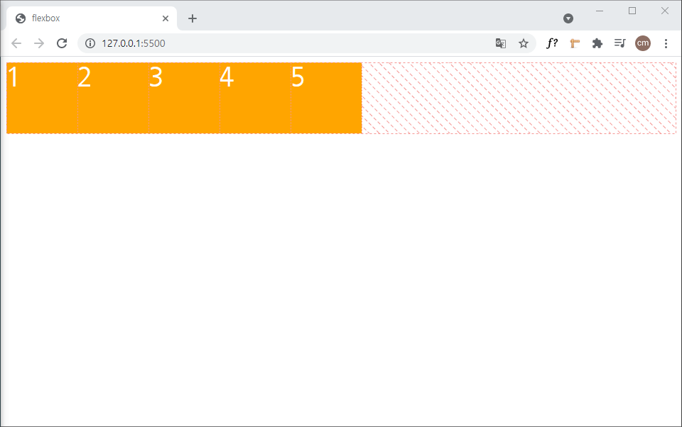

<br>

```css
.container {
    display: flex;
    flex-direction: column;
}
```


<br>

```css
.container {
    display: flex;
    flex-direction: row-reverse;
}
```

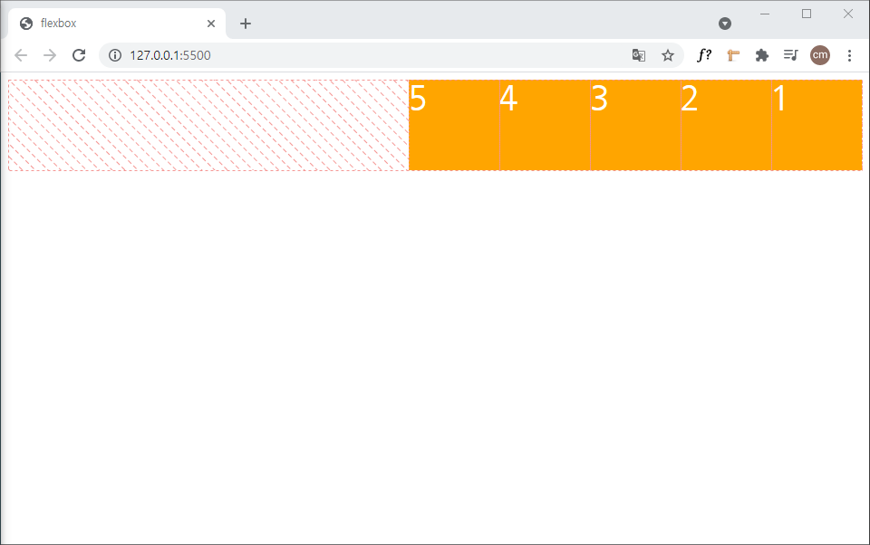

<br>

```css
.container {
    display: flex;
    flex-direction: column-reverse;
}
```

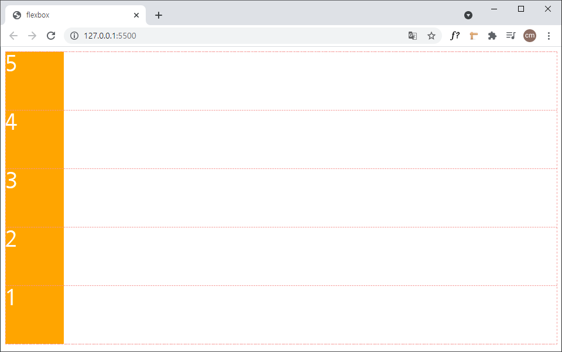

<br>

#### justify-content & align-items

`justify-content` 는 `main-axis` 에서 어떻게 정렬할 것인가를 지정한다.

`align-items` 는 `cross-axis` 에서 어떻게 정렬할 것인가를 지정한다.

좀 더 자세히 설명하면 `flexbox` 의 `flex-direction` 이 `row` 일때 `main-axis` 는 가로이다.

이때 `justify-content` 를 `space-between` 으로 지정한다면 아래처럼 가로에서 정렬 상태가 변화된다.

```css
.container {
    display: flex;
    /* flex-direction: row; */
    justify-content: space-between;
}
```

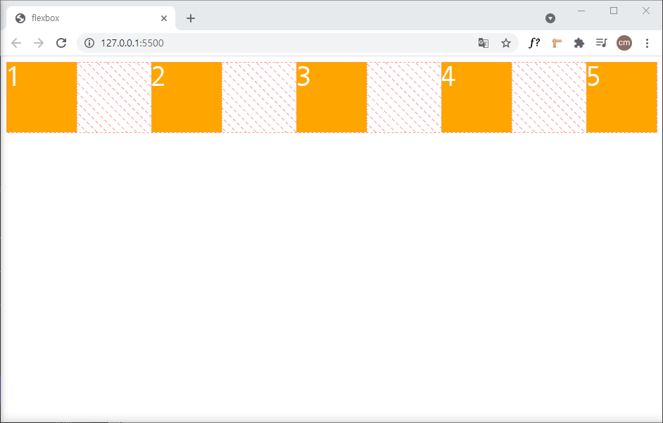

<br>

`flex-direction` 이 `column` 이면 `main-axis` 는 세로이다.

이때 `justify-content` 를 똑같이 지정하면 아래와 같이 변화된다.

```css
.container {
    display: flex;
    flex-direction: column;
    justify-content: space-between;
}
```


이처럼 `main-axis` 가 어떤가에 따라 `justify-content` 의 값의 보이는 형태가 결정된다.

다음은 `align-items` 를 자세히 살펴보자.

`align-items` 는 `cross-axis` 에 따라 달라진다.

`flex-direction` 이 `row` 이면 `cross-axis` 는 세로이다.

이때 `align-items` 값을 `center` 로 지정했을 때 아래와 같이 변화된다.

```css
.container {
    display: flex;
    /* flex-direction: row; */
    align-items: center;
}
```

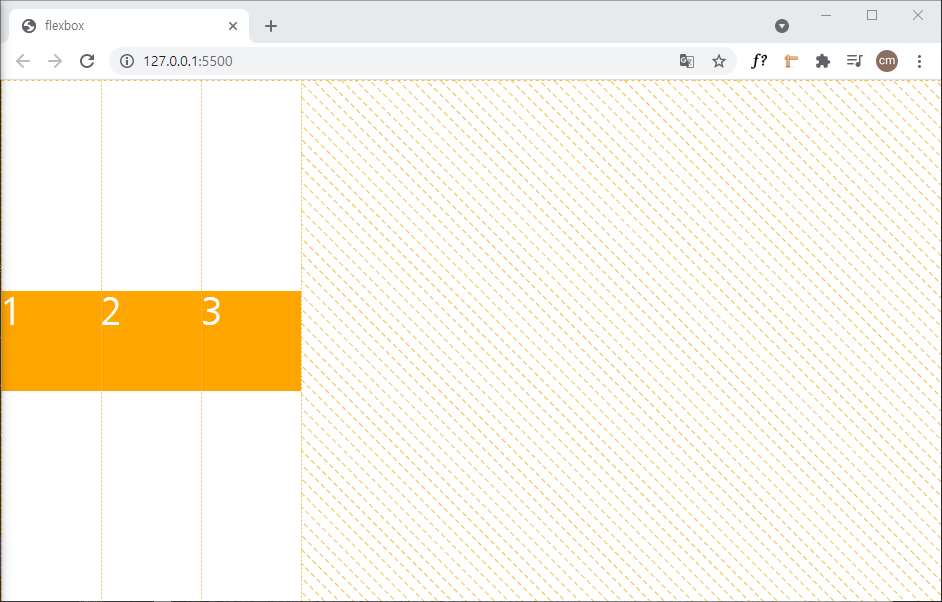

<br>

`flex-direction` 이 `column` 이면 `cross-axis` 는 가로이다.

이때 `align-items` 값을 똑같이 했을 때 아래와 같다.

```css
.container {
    display: flex;
    flex-direction: column;
    align-items: center;
}
```

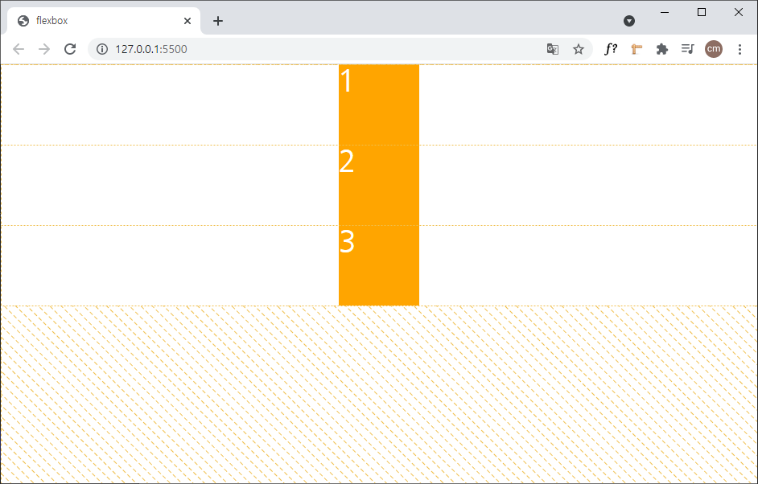

<br>

`justify-content` 와 `align-items` 는 위의 예시 말고도 여러 값을 가질 수 있다.

`justify-content` 는 `flex-start` `flex-end` `center` `space-between` `space-around` `space-evenly` 를 가질 수 있다.

`flex-start` 는 기본 값이다.

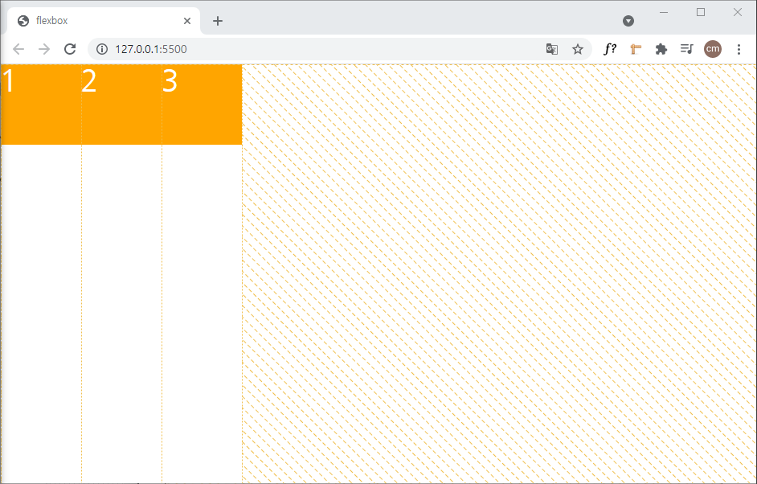

`flex-end` 는 `main-axis` 의 끝으로 정렬한다.

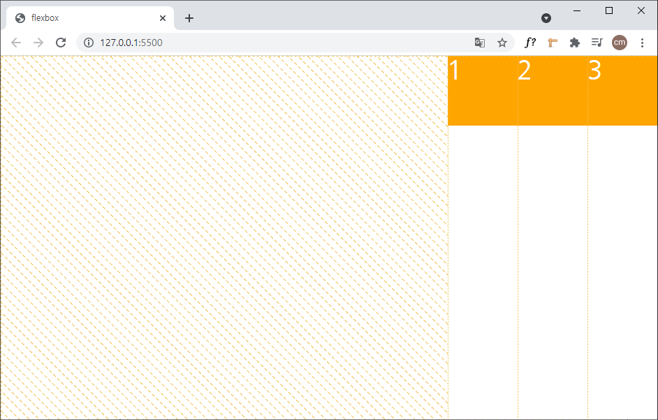

`center` 는 가운데 정렬이다.


`space-between` 은 첫 번째 `item` 은 시작점에 마지막 `item` 은 끝점에 위치하고 나머지 아이템은 여백이 일정하게 정렬한다.

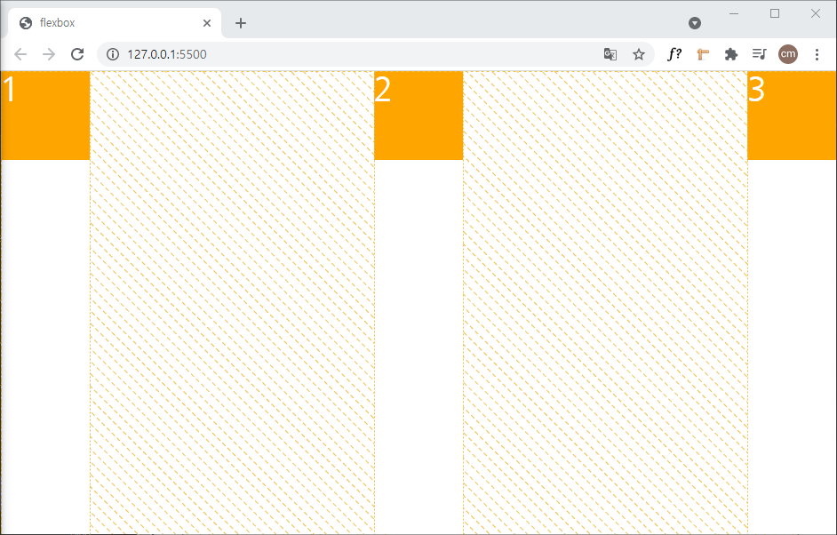

`space-around` 는 모든 `item` 이 동일한 여백을 가지고 정렬된다.

동일한 여백이라는 것은 `main-axis` 에 따라 만약 가로라면 각 `item` 의 좌우로 여백이 모두 존재한다.

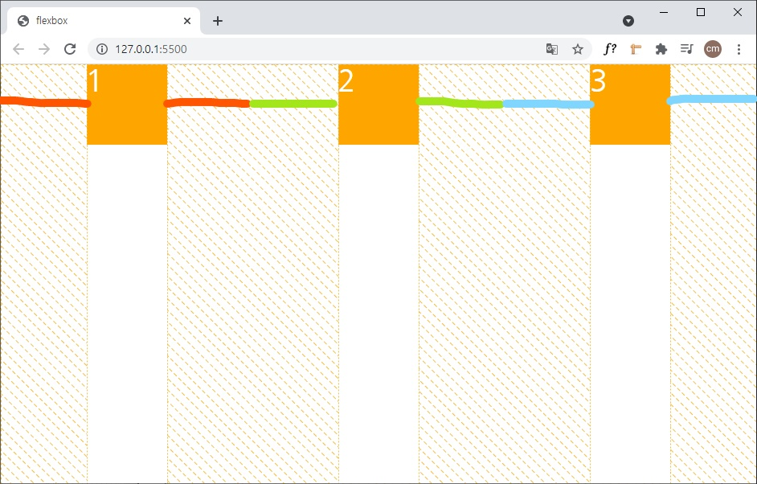

`space-evenly` 는 `item` 간의 모든 간격이 동일하다.

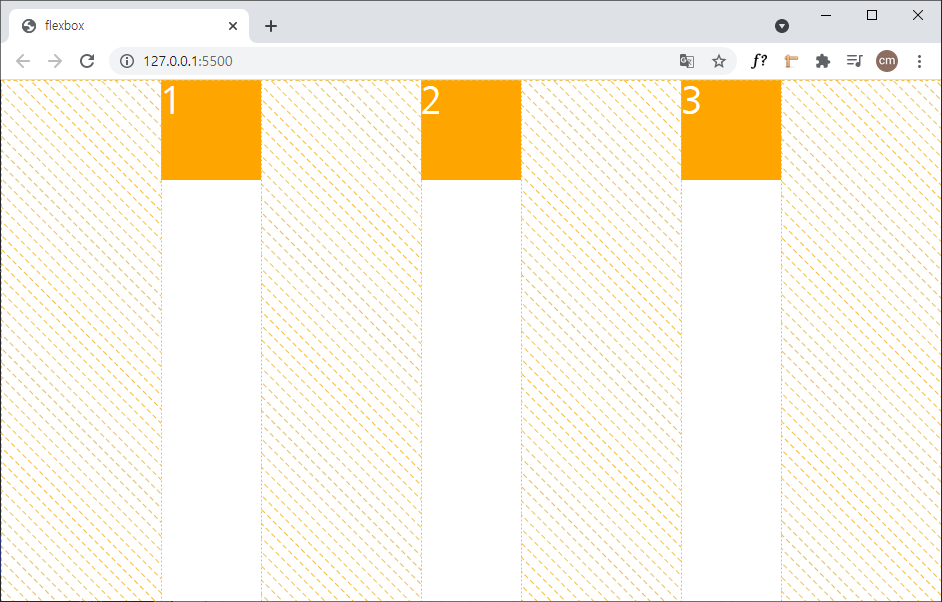

<br>

`align-items` 는 5가지 값 `stretch` `baseline` `flex-start` `flex-end` `baseline` 을 가진다.

`stretch` 는 기본 값으로 `item` 의 길이가 정해지지 않고 `container` 가 `cross-axis` 에 해당하는 길이를 가지고 있다면 이 길이에 맞게 `item` 이 늘어난다는 의미이다.

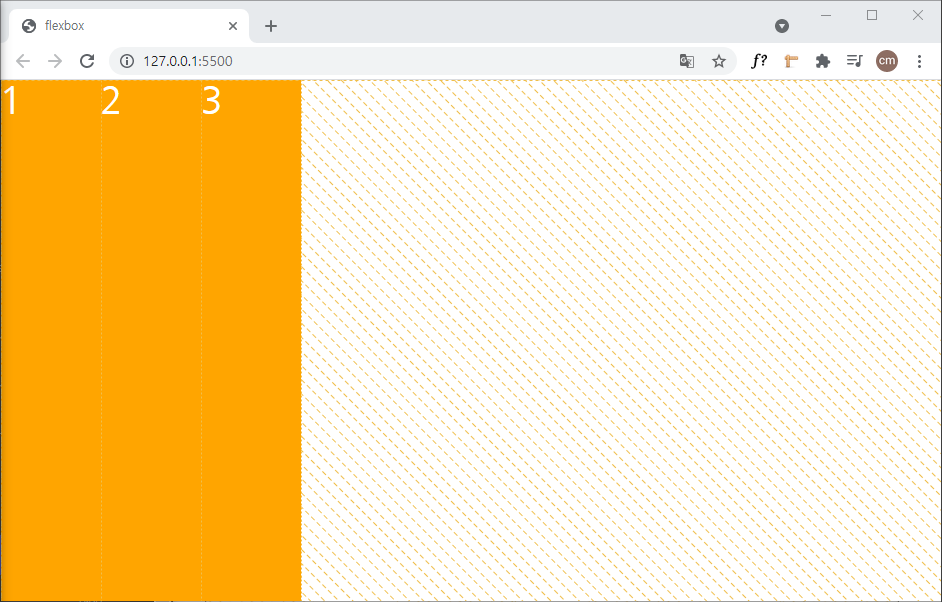

나머지 값들은 `justify-content` 와 비슷하게 작동한다.

<br>

#### align-self

개별 `item` 에 `align-items` 의 값을 주어 변화시킬 수 있다.

예를 들어 2번 아이템에 `center` 값을 주면 `cross-axis` 에 따라 컨테이너의 세로를 기준으로 가운데 정렬이 되는 것을 볼 수 있다.


<br>

#### order

`order` 를 통해 개별 요소에 순서를 지정할 수 있다.

`order` 는 정수 값을 가지고 음수도 가능하다. 기본 값은 `0` 을 가진다.

만약 2번 `item` 을 가장 앞에 놓고 싶다면 기본 값이 `0` 이기 때문에  `-1` 을 주면 앞으로 온다.


맨 뒤에 놓고 싶으면 `1` 을 주어 맨 뒤로 보낼 수 있다.

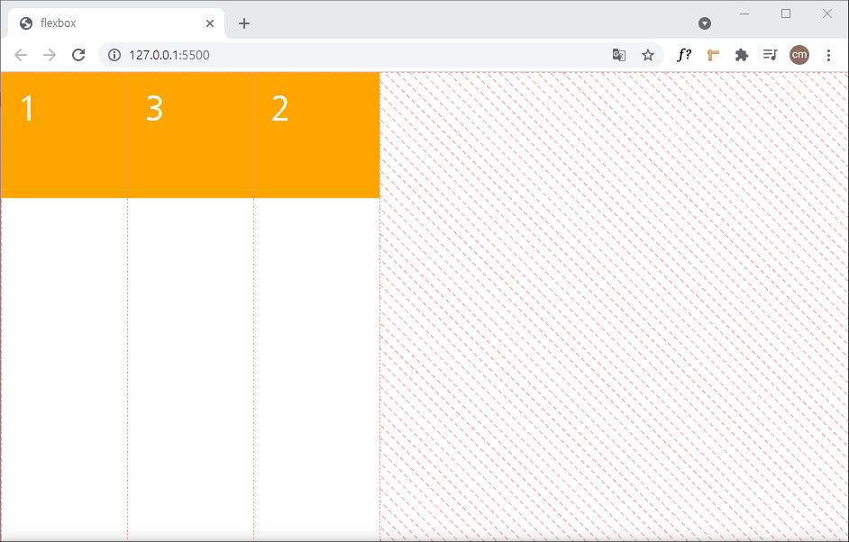

<br>

#### flex-wrap

위에서 설명한 `flexbox` 의 특성 중 하나는 1차원 모델이라는 것이다.

만약에 `item` 의 `width` 가 `200px` 으로 5개이고 `container` 는 블록요소로 `width` 가 뷰포트와 같다.

`item` 의 `width` 값을 다 합친 `1000px` 보다 브라우저를 작게 줄인다면 `item` 이 아래처럼 찌그러져 1차원을 벗어나지 않는다.


그림으로도 확인이 어려우니 개발자 도구로 확인하면 `188px` 로 찌그러졌다.

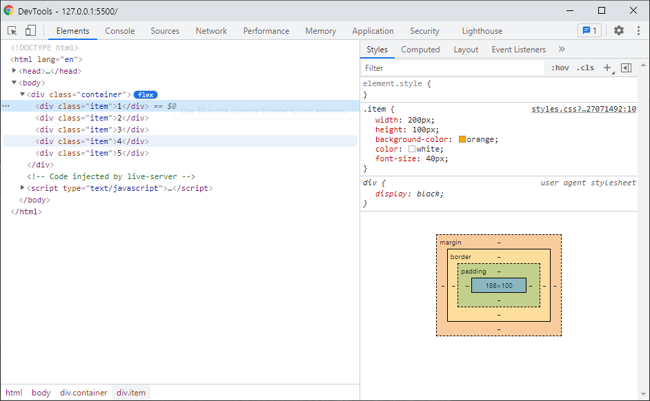

이를 방지하기 위해서 `wrap` 이라는 값을 주면 아래처럼 찌그러지지 않고 다음 줄로 넘겨준다.

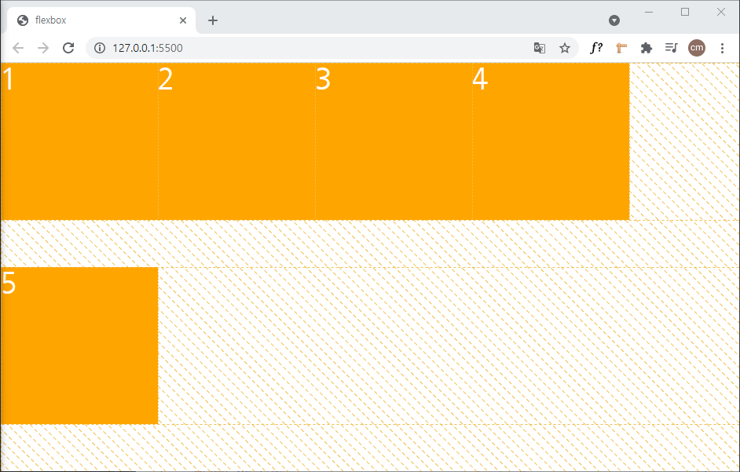

`wrap` 말고 `wrap-reverse` 값도 가질 수 있는데 이것은 아래처럼 반대로 정렬해준다.


기본 값은 찌그러지는 상태로 `nowrap` 이다.

<br>

#### align-content

`align-content` 는 `flex-wrap` 을 통해서 2줄이상이 생겼을 때 줄 간의 정렬상태를 지정한다.

값으로는 `stretch` `flex-start` `flex-end` `center` `space-between` `space-around` 를 가질 수 있다.

`align-content` 는 `cross-axis` 에 따른 정렬이다.

`stretch` 는 기본 값으로 `container` 의 크기에 따라 달라지는데 `align-items` 와 비슷하게 작동한다.

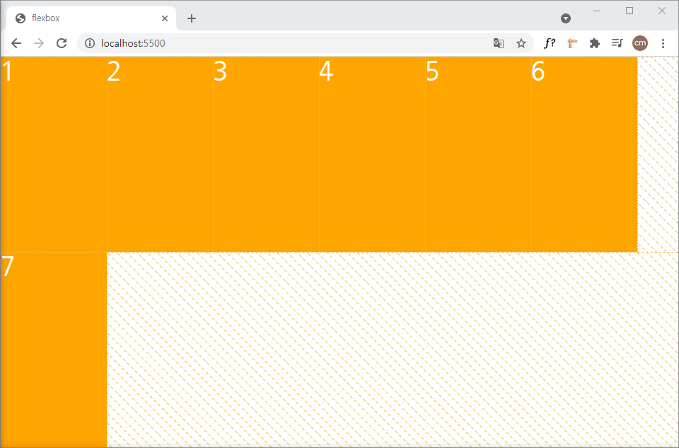

`flex-start` 는 `container` 에서 `cross-axis` 의 시작점을 기준으로 정렬하고 `flex-end` 는 끝점을 기준으로 정렬한다.

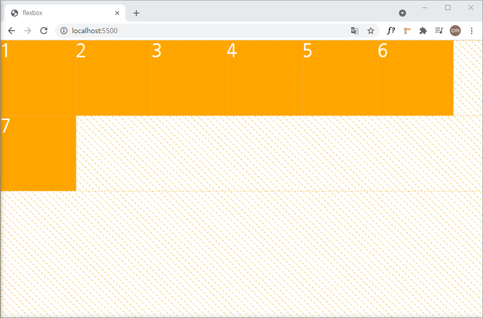

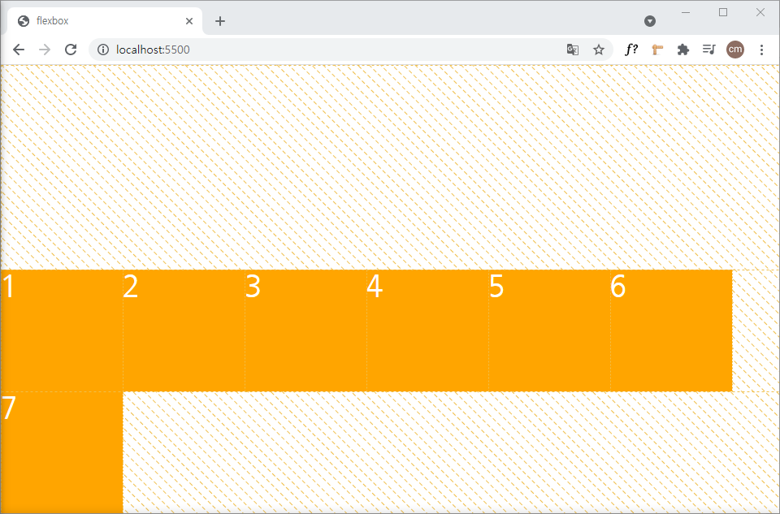

`center` 는 `container` 에서 가운데 정렬이다.

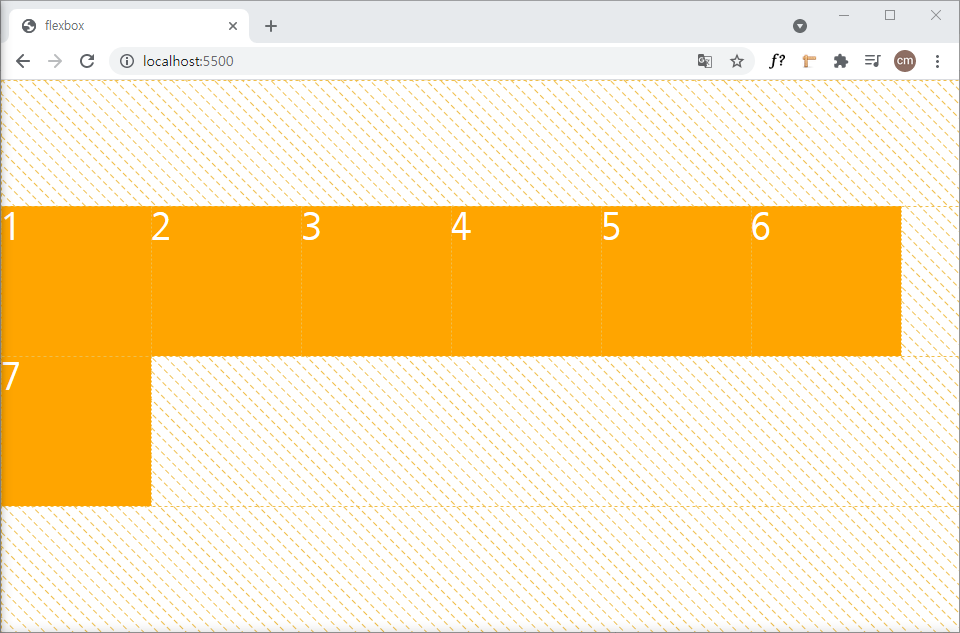

`space-between` `space-around` 의 작동은 `justify-content` 를 생각하면 쉽다. 하지만 기준이 되는 `axis` 는 다르니 주의하자.


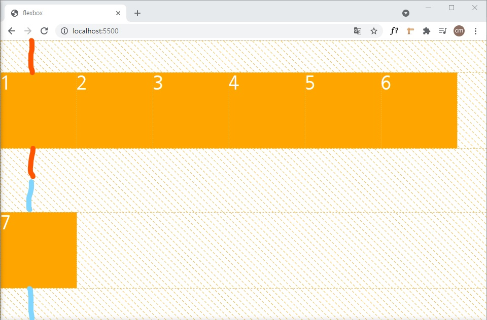

<br>

#### flex-shirnk

`flex-wrap` 에서 본 것 처럼 `flexbox` 는 1차원이기 때문에 찌그러지는 경우가 발생한다.

`flex-shrink` 는 찌그러질 때 `item` 들의 찌그러지는 비율을 설정할 수 있다.


위 그림은 `width` 가 `300px` 인 `item` 3개를 가진 `flexbox` 이다.

여기서 뷰포트를 줄여서 찌그러지게 만들 때 2번 `item` 을 다른 `item` 보다 3배로 찌그러지게 만들고 싶다면 값으로 `3` 을 주고 형태는 아래와 같다.

```css
.item:nth-child(2) {
    background-color: black;
    flex-shrink: 3;
}
```


<br>

#### flex-grow

`flex-grow` 는 `flex-shrink` 와 반대로 얼만큼의 비율로 늘어날 것인가를 의미한다.

2번 `item` 에 값을 양수의 아무 값을 주고 나머지는 값을 주지 않는다면 늘릴 수 있는 최대를 늘려서 공간을 차지한다.

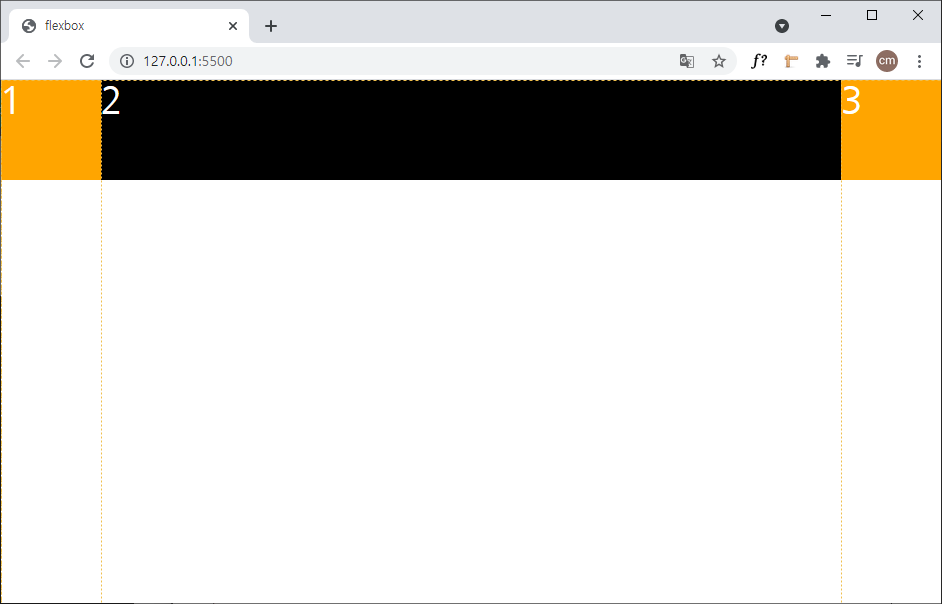

만약에 1번이나 3번 `item` 에도 값을 준다면 비율에 맞는 공간을 차지 한다.

비율은 `item` 의 원래 `width` 인 `100px` 을 제외한 뷰포트의 공간에서 비율을 가진다.

<br>

#### flex-basis

`flex-basis` 는 `item` 을 늘리거나 찌그러지기 전에 초기 값을 설정해주는 것을 말한다.

`width` 값을 가질 수 있는데 보통은 `width` 를 지정하기 때문에 잘 쓰지 않는다고 한다.
