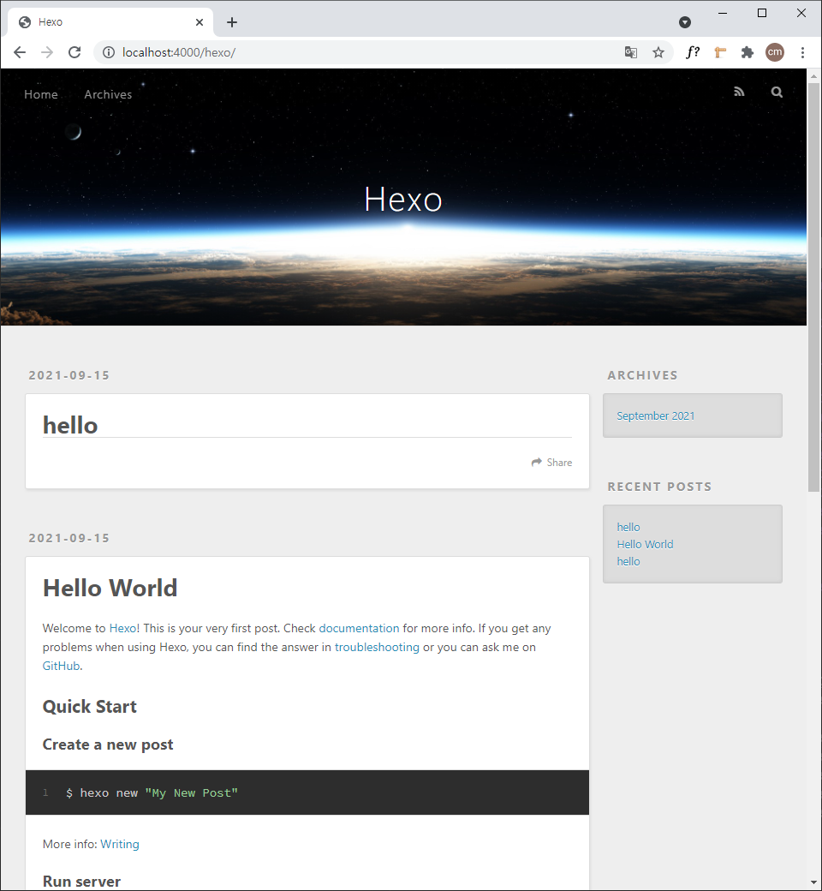

`til` 을 3주 가까이 해오면서 내용이 점점 쌓여가고 있다.

나는 `github` 에 `day` 별 폴더를 올려서 현재 18일차에 18개의 폴더와 +&alpha; 의 파일이 생겼다.

이렇게 올리다보니 처음에는 내용이 적어서 찾기가 쉬웠지만 한 달도 안된 지금부터 벌써 원하는 내용을 찾아보기가 힘들다.

`github` 에 링크를 통해 목록화를 하든지 웹 사이트화 하여 보기 편하도록 커스텀을 하든지 어떻게든 해결하기로 마음 먹었다.

그런데 링크를 통한 목록화도 몇 달 정도만 하더라도 복잡해질 것은 마찬가지일 것 같았다.

커스텀을 하자니 너무 오래걸릴 것 같아서 일단 `markdown` 을 `html` 화해서 웹 사이트에 목록을 만들고 연결시켜두고 사이트 모양은 차차 완성을 목표로 했다.

`html` 화 할 수 있는 `markdown-it` 이라는 모듈을 찾았는데 `js` 의 파일 시스템은 아직 잘 몰라서 다음 기회에 하기로 했다.

다른 방법을 찾아보다가 처음으로 **정적 사이트 생성기**라는 것을 알게 되었다.

<br>

#### Hexo

정적 사이트 생성기는 내가 원하던 바와 일치하는 기능을 가졌기 때문에 그 중에 나에게 익숙한 `node.js` 를 기반으로 한 `hexo` 를 이용해 만들어 보기로 했다.

`hexo` 공식 문서를 살펴보면 `git-page` 로 배포하여 사용할 수 있다고 한다.

#### GitHub Page 활성화

블로그나 공식 문서의 시작 가이드를 보면 `repository` 의 이름을 `[username].github.io` 형식으로 하라고 하는데 하지 않아도 된다.

본인이 원하는 `repository` 이름을 정하고 `public` 으로 생성한다.

`readme.md` 파일이나 `index.html` 등 아무 파일을 생성하면 `setting/Pages ` 탭에서 페이지를 활성화 할 수 있다.

#### Set up Hexo 

`hexo` 를 시작하기 위해서는 `node.js` 와 `git` 이 설치된 환경이어야 한다.

```bash
$ npm install hexo-cli -g
$ hexo init blog
$ cd blog
$ npm install
```

설치 하고 `hexo server` 명령어를 실행하면 `http://localhost:4000` 에서 아래 사진처럼 확인이 가능하다.



#### New Post

새로운 포스트를 작성하는 방법은 아래 명령어를 활용하면 빈 포스트가 생성이 된다.

``` bash
$ hexo new post [postname]
```

포스트의 생성 위치는 `sources/_posts` 이다.

여러가지의 사이트의 커스텀 방법이 존재하지만 이것은 나중에 보도록 하고 `git-page` 로 연결시켜보도록 하자.

#### Connect git and hexo

여기까지의 `hexo` 는 개발 환경을 만든 것과 비슷하다고 할 수 있다.

이제 배포할 파일을 만들어주고 활성화한 `github page` 저장소에 올려주는 작업을 해야 한다.

그 전에 배포를 위해서는 플러그인 하나가 필요하다.

```bash
npm install --save hexo-deployer-git
```

설치를 했으면 이제 연결시키고 명령어를 통해 배포해야한다.

`_config.yml` 파일에 가면 `URL` 항목과 `deploy` 항목에 대한 작성이 필요하다.

```yaml
# URL
url: https://[username].github.io/[repository name]

# Deployment
deploy:
	type: git
	repo: https://github.com/[username]/[project]
	branch: master
```

작성 후에 명령어를 실행하고 사이트를 가면 똑같은 화면을 볼 수가 있다.

```bash
$ hexo generate
$ hexo deploy
```

`hexo generate` 를 하면 `public` 이라는 파일이 생성될 것이다.

`hexo deploy` 로 이 파일이 `github` 에 올라가고 페이지로서 보여지는 방식이다.

<br>

`hexo` 를 하다보니 `github-page` 도 정적 사이트 생성기처럼 `markdown` 을 변환해서 보여주는 기능이 있다는 것을 알았다.

꼭 `hexo` 가 아니어도 `github` 만으로도 사이트 생성이 되므로 이 방법을 사용하는 것도 좋을 것 같다.