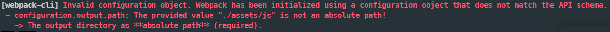

## webpack

우리가 개발하기 위한 여러 **모듈**을 브라우저가 이해할 수 있도록 변환하고 **묶어주는** ```module bundler``` 

**필요한 이유**

여러 가지 ```js``` 파일을 포함하는 페이지보다 ```webpack```을 통해 하나의 파일로 묶어서 성능 최적화가 가능하다.

```js framework``` 들은 대부분 ```webpack```을 포함하고 있고 설정을 건드리는 일이 잘 없다고 한다.
그래도 이것이 무슨 역할을 하고 어떻게 작동하는지 알아보자.


### 시작하기

#### Basic Setup

```bash
npm install webpack webpack-cli --save-dev
```

```webpack``` 설정 파일인 ```webpack.config.js``` 파일을 작성하기 전에

#### concepts

**Entry**

- **처리**해줘야 하는 파일이다.

  - 여기서 **처리**는 변환하고 묶어준다는 것을 뜻한다.

- 여러 파일이 존재할 수 있다.

  ```javascript
  module.exports = {
      entry: {
          [NAME]: BASE_JS + "main.js"
      }
      ...
  }
  ```

- `entry` 에서 파일의 이름 `[NAME]` 을 지정할 수 있다.

**Output**

- 결과물의 위치 지정 ```path``` 과 파일명 `filename `을 정한다.

  - 위치는 절대 경로를 통한 위치를 의미한다.

  - 

  - 절대경로를 쓰지 않으면 위와 같은 에러를 볼 수 있다.  
  

  ```javascript
  const path = require("path");
  
  module.exports = {
      entry: {
          [NAME]: BASE_JS + "main.js"
      },
      output: {
          filename: "js/[name].js",
          path: path.resolve(__dirname, "assets"),
          clean: true,
      }
  }
  ```

- `filename` 에 `[name]` 을 통해 entry의 `[NAME]` 을 적용시킬 수 있다.

- `path` 내장 모듈을 사용한다.

  - `resolve` 함수로 두 파라미터를 연결한다.
  
  - `__dirname` 은 현재 파일의 위치의 절대 경로 값이다.

- `clean` 속성은 결과물을 내기 전에 파일을 지운다는 의미이다.

**Rules**

- 각각의 파일 종류에 따라 어떤 변환을 할 것인가를 결정한다.

  - `rule`은 속성 2가지를 가진다.
  
    - `test` : 어떤 파일을 변환할 것인가

    - `use` : 어떤 `loader`를 사용하여 변환할 것인가  


  ```javascript
  module.exports = {
      ...
      entry: {
          main: BASE_JS + "main.js"
      },
      ...
      module: {
          rules: [
              {
                  test: /\.js$/,
                  use: {
                      loader: "babel-loader",
                      options: {
                          presets: [["@babel/preset-env", { targets: "defaults" }]]
                      }
                  }
              },
              {
              	test: /\.scss$/,
                  use: ["style-loader", "css-loader", "sass-loader"]
              }
          ]
      }
  }
  ```

  **Loader**

  - 파일을 해석하고 변환한다.

    **babel-loader**

    `es6+` 를 `es5` 로 변환한다.

    **sass-loader**

    `entry` 에서 `scss` 파일을 `css` 파일로 변환한다.

    **css-loader**

    변환된 `css` 파일로 브라우저에 들어갈 `css` 로 변환한다.

    **style-loader**

    `css-loader` 가 변환한 `css` 를 `html`의 `<head>` 태그에 삽입한다.

    

- **잠깐 !**  - **Babel ?**

  - `babel` 은 자바스크립트의 최신 문법 코드를 사용할 수 있게 해주는 플러그 인

  ```bash
  npm install @babel/core @babel/preset-env --save-dev
  ```


**Plugins**

- 결과물의 형태를 바꿔준다.

  ```javascript
  const MiniCssExtractPlugin = require("mini-css-extract-plugin");
  
  module.exports = {
      ...
      plugins: [
          new MiniCssExtractPlugin({
              filename: "css/styles.css",
          })
      ],
      ...
      {
          test: /\.scss$/,
          use: [MiniCssExtractPlugin.loader, "css-loader", "sass-loader"]
      },
      ...
  }
  ```

  **mini-css-extract-plugin**

  - `style-loader` 의 방식과 다르게 따로 파일을 분리시킨다.

**Mode**

- 세가지 모드가 존재 : `development`  `production`  `none`

  - `development` - 개발 환경
  - `production` - 운영 환경

- `mode` 는 `node.js` 환경에서 `scripts` 를 통해 지정할 수도 있다.

  ```json
  {
      "scripts": {
          "dev:assets" : "webpack --mode=[MODE]"
      }
  }
  ```


### webpack.config.js

```javascript
const MiniCssExtractPlugin = require("mini-css-extract-plugin");
const path = require("path");

const BASE_JS = "./src/client/js/"

module.exports = {
    mode: development,
    entry: {
        main: BASE_JS + "main.js"
    },
    plugins: [
        new MiniCssExtractPlugin({
            filename: "css/styles.css",
        })
    ],
    output: {
        filename: "js/[name].js",
        path: path.resolve(__dirname, "assets"),
        clean: true,
    },
    module: {
        rules: [
            {
                test: /\.js$/,
                use: {
                    loader: "babel-loader",
                    options: {
                        presets: [["@babel/preset-env", { targets: "defaults" }]]
                    }
                }
            },
            {
            	test: /\.scss$/,
                use: [MiniCssExtractPlugin.loader, "css-loader", "sass-loader"]
            }
        ]
    }
}
```
