### Grid

1차원 레이아웃으로 `flexbox` 를 사용할 수 있다.

행과 열이 필요한 레이아웃에 `flexbox` 를 사용할 수 있지만 복잡하고 `table` 을 사용하는 것은 적절하지 않다.

이런 2차원 레이아웃을 위한 시스템이 `grid` 이다.

컨테이너를 `grid` 로 만들고 싶다면 아래와 같이 선언하면 된다.

```css
.container {
  display: grid;
}
```

`grid` 는 `flexbox` 와 마찬가지로 컨테이너 내부 아이템을 어떻게 할 것인가를 다룬다.

<br>

`grid` 에는 행과 열을 개수와 크기를 어떻게 설정할 것인지 지정하는 `grid-template-columns` `grid-template-rows` 라는 속성이 있다.

#### grid-template-columns

`column` 의 크기는 `<length>` `<percentage>` 도 사용이 가능하고 `fr` 이라는 단위를 사용하여 설정할 수도 있다.

개수는 각 크기 값의 개수를 따른다.

아래 예시는 각 `column` 의 크기가 `120px` `240px` `360px` 로 3개를 가진다.

```css
.container {
  display: grid;
  grid-template-columns: 120px 240px 360px;
}
```

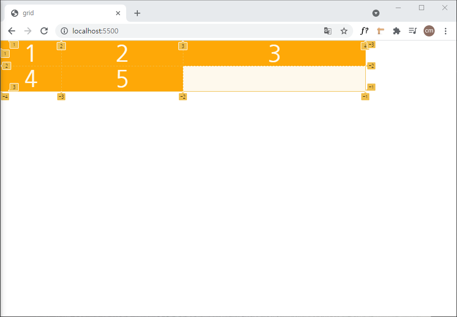

#### grid-template-rows

`row` 도 `column` 과 마찬가지로 각 크기와 개수를 가진다.

아래 예시는 각 `row` 의 크기가 전체 뷰포트 높이의 `1:1:1` 비율을 가진다.

```css
body {
  height: 100vh;
}

.container {
  height: 100%;
  display: grid;
  grid-template-rows: 1fr 1fr 1fr 1fr 1fr;
}
```

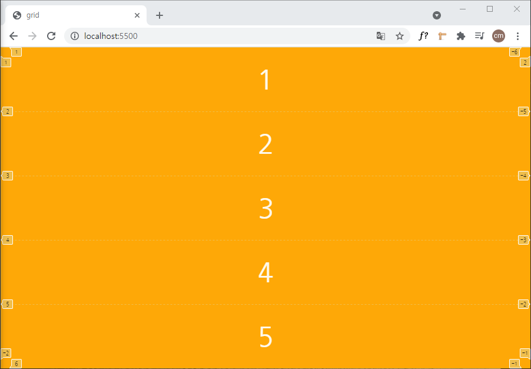

위 그림처럼 똑같은 값을 가지는 그리드는 `repeat()` 이라는 함수를 사용할 수도 있다.

```css
.container {
  display: grid;
  grid-template-rows: repeat(5, 1fr);
}
```

<br>

일반 `grid` 에서는 각 아이템 간의 간격이 존재하지 않는다.

`row-gap` `column-gap` `gap` 을 사용해서 간격을 지정할 수 있다.

#### row-gap

`row` 간의 간격을 의미한다.

```css
.container {
  display: grid;
  grid-template-columns: repeat(3, 1fr);
  grid-template-rows: repeat(3, 100px);
  row-gap: 30px;
}
```

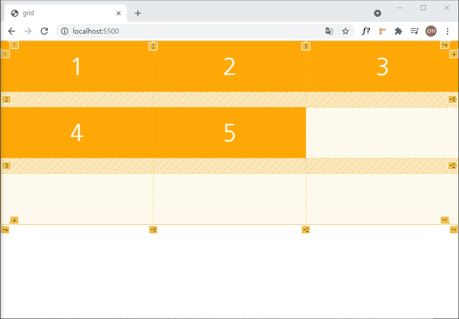

#### column-gap

`column` 간의 간격을 의미한다.

```css
.container {
  display: grid;
  grid-template-columns: repeat(3, 1fr);
  grid-template-rows: repeat(3, 100px);
  column-gap: 40px;
}
```

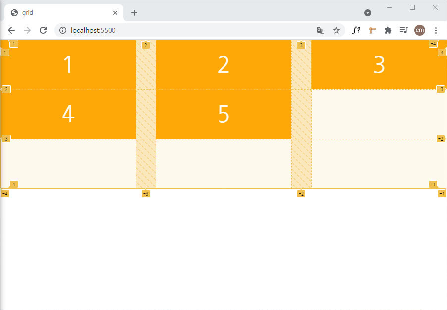

#### gap

하나의 값을 주면 `row` 와 `column` 간격이 모두 동일하다.

두 개의 값을 주면 `row` `column` 의 순서로 간격이 설정된다.

```css
.container {
  display: grid;
  grid-template-columns: repeat(3, 1fr);
  grid-template-rows: repeat(3, 100px);
  gap: 10px 50px;
}
```

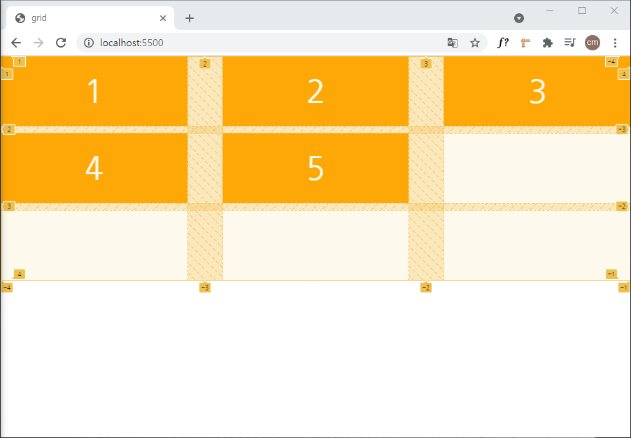

<br>

#### grid-template-areas

`grid` 내의 `item` 이 공간을 얼마나 차지할지를 `item` 의 이름을 통해 한 번에 설정할 수 있는 속성이다.

`grid-area` 라는 속성을 `item` 에 **이름**과 함께 선언하여 사용한다.

```css
.container {
  height: 400px;
  display: grid;
  grid-template-areas:
    "header header header header"
    "content content content nav"
    "content content content nav"
    "footer footer footer footer";
}

.header {
  grid-area: header;
  background-color: yellowgreen;
}

.content {
  grid-area: content;
  background-color: orange;
}

.nav {
  grid-area: nav;
  background-color: skyblue;
}

.footer {
  grid-area: footer;
  background-color: #c180ff;
}
```

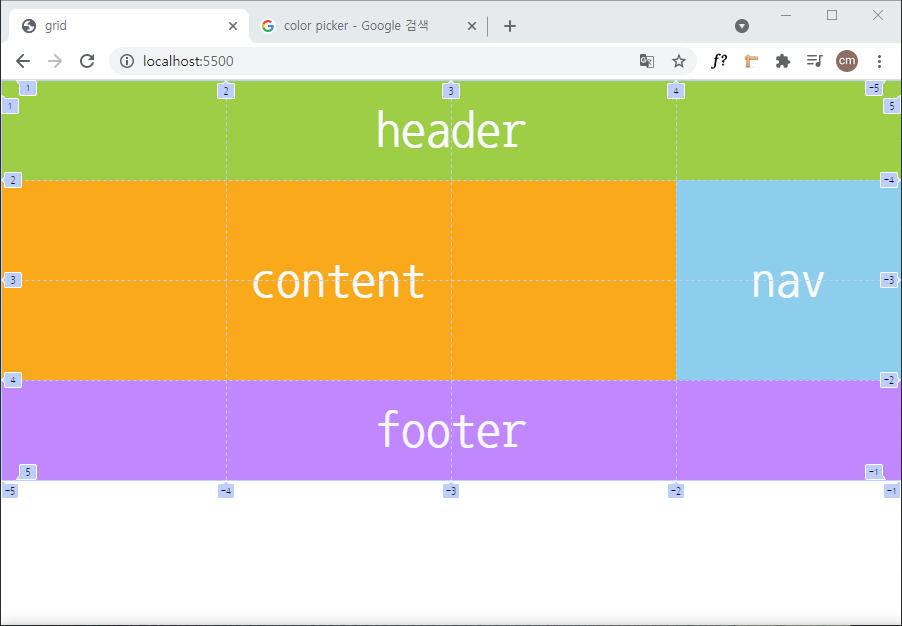

#### grid row and column

`grid` 내의 `item` 이 차지할 공간 지정으로 `grid-template-areas` 를 사용할 수 있다.

`item` 에 `grid-column-start` `grid-column-end` `grid-row-start` `grid-row-end` 속성을 통해 공간을 지정할 수도 있다.

```css
.container {
  display: grid;
  grid-template-columns: repeat(4, 1fr);
  grid-template-rows: repeat(4, 100px);
}
```

위의 컨테이너는 `4x4` 크기의 아래 그림과 같은 모양을 가진다.

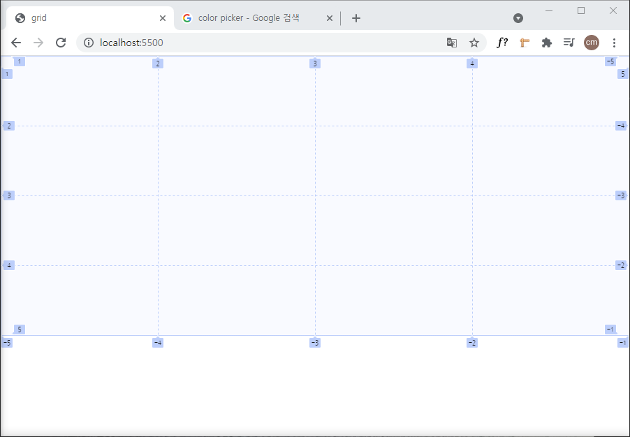

여기에 `item` 4개를 추가하면 이런 모양이다.

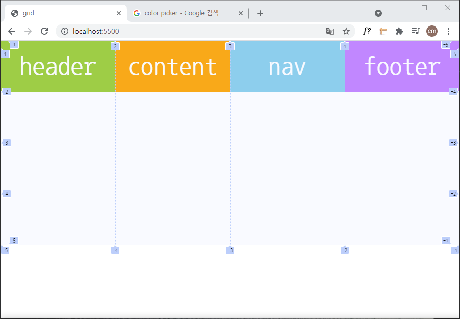

이제 각 `item` 에 차지할 공간을 줄 것이다.

그런데 개발자 도구를 통해 살펴보면 `grid` 의 각 라인에 숫자가 붙어있다.

이를 이용하여 공간 지정이 가능한 것이다.

각 라인의 시작과 끝을 정해주면 `grid-template-areas` 로 지정했던 결과와 동일하게 나타낼 수 있다.

```css
.header {
  background-color: yellowgreen;
  grid-column-start: 1;
  grid-column-end: 5;
}

.content {
  background-color: orange;
  grid-column-start: 1;
  grid-column-end: 4;
  grid-row-start: 2;
  grid-row-end: 4;
}

.nav {
  background-color: skyblue;
  grid-row-start: 2;
  grid-row-end: 4;
}

.footer {
  background-color: #c180ff;
  grid-column-start: 1;
  grid-column-end: 5;
}
```

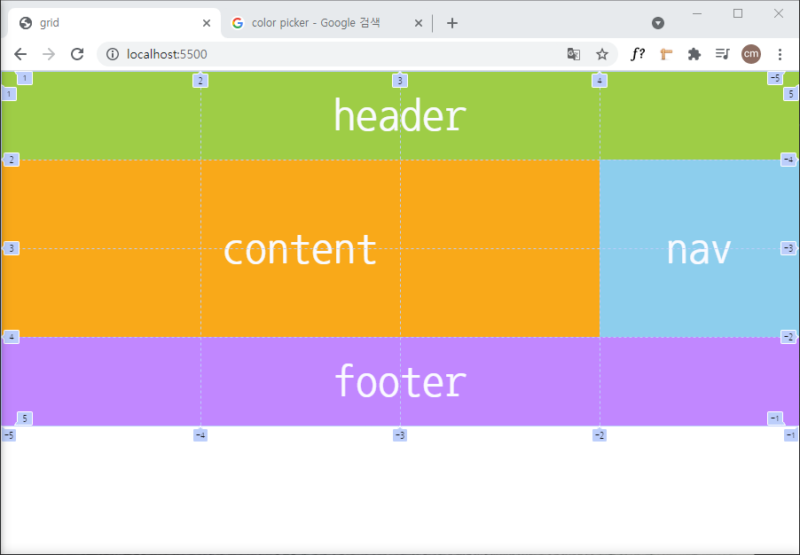

완성하고 보니 코드가 꽤나 지저분하고 복잡하다고 느낄 수 있다.

이를 간결하게 쓸 수 있는 속성도 있다. `grid-column` `grid-row` 이다.

이 속성은 `start line number / end line number` 를 사용하여 똑같이 적용이 가능하다.

```css
/* skip background-color */
.header {
  grid-column: 1 / 5;
}

.content {
  grid-column: 1 / 4;
  grid-row: 2 / 4;
}

.nav {
  grid-row: 2 / 4;
}

.footer {
  grid-column: 1 / 5;
}
```

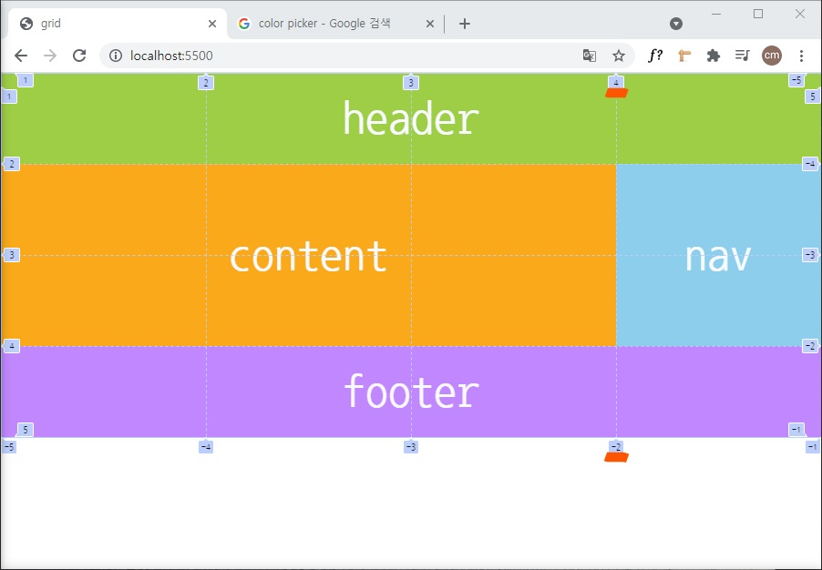

위 그림을 보면 `4` 번 라인을 `-2` 라고도 표현이 가능하다.

그래서 코드 작성 시에 아래처럼 표시할 수 도 있다.

```css
/* skip background-color */
.header {
  grid-column: 1 / -1;
}

.content {
  grid-column: 1 / -2;
  grid-row: 2 / -2;
}

.nav {
  grid-row: 2 / -2;
}

.footer {
  grid-column: 1 / -1;
}
```

<br>

#### place items

`item` 의 정렬 방법을 정하는 속성이다.

종류로는 `justify-items` `align-items` 이 있다.

`justify-items` 는 `item` 에서 가로 정렬에 대한 속성이고 `align-items` 는 세로 정렬에 대한 속성이다.

두 가지의 기본 값은 `stretch` 이다. 그래서 전에 했던 예시를 보면 `background-color` 가 `item` 의 `cell` 영역에 다 채워지는 것이다.

`flexbox` 에서 사용했던 속성과 비슷하게 작동한다.

```css
.container {
  display: grid;
  grid-template-columns: repeat(4, 1fr);
  grid-template-rows: repeat(4, 100px);
  justify-items: center;
}
```

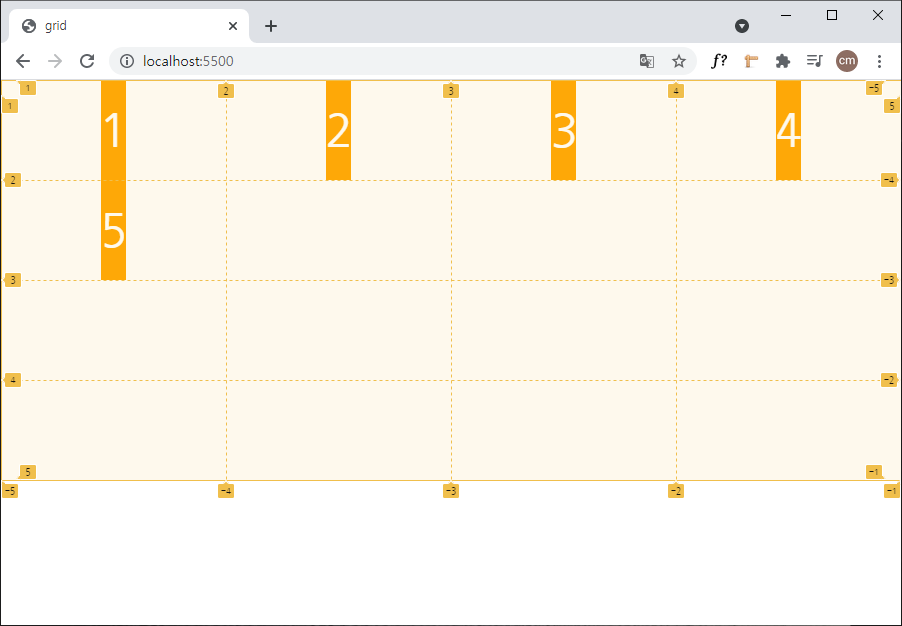

위 예시는 `justify-items` 값을 `center` 로 주어 가로 기준으로 가운데 정렬이 된 것을 볼 수 있다.

만약에 `align-items` 도 `center` 를 주면 아래처럼 보인다.

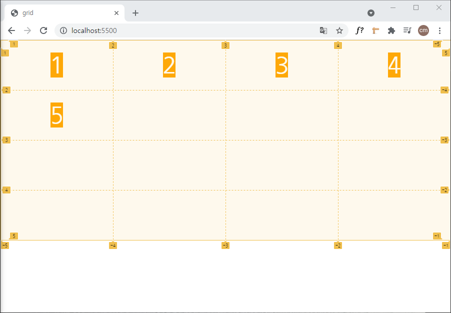

<br>

#### place content

`item` 들의 정렬을 했다면 `content` 에 대한 정렬도 있다.

여기서 `content` 의 의미는 `grid` 에서 `column` 이나 `row` 자체를 말한다.

속성의 종류로는 `justify-content` `align-content` 가 있다.

`justify-content` 는 `column` 에 대해 `align-content` 는 `row` 에 대한 정렬을 의미한다.

`justify-content` 를 `space-around` 값을 주고 `align-content` 값은 `space-between` 을 주면 아래와 같다.

```css
body {
  height: 100vh;
}

.container {
  height: 100%;
  display: grid;
  grid-template-columns: (4, 100px);
  grid-template-rows: (4, 100px);
  justify-content: space-around;
  align-content: space-between;
}
```

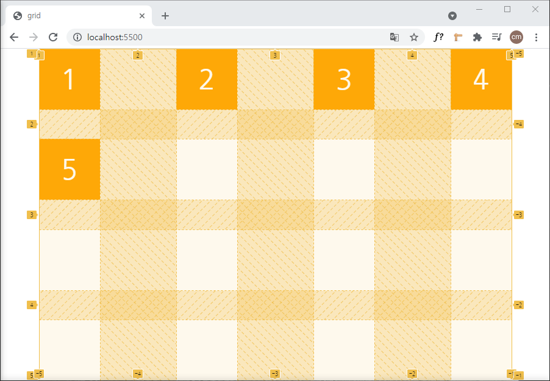

<br>

#### auto columns and rows

`template` 으로 `grid` 를 `4x4` 사이즈의 각 `100px` 로 만들었다.

그런데 `template` 을 벗어나는 `item` 들이 발생했다.

```css
.container {
  display: grid;
  grid-template-columns: repeat(4, 100px);
  grid-template-rows: repeat(4, 100px);
}
```

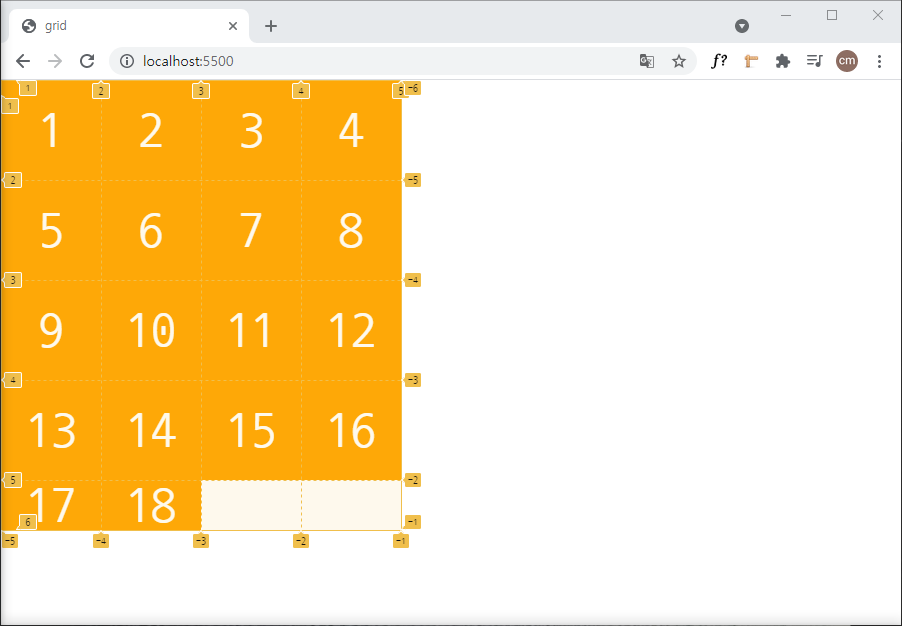

이 `item` 들의 처리를 `grid-auto-columns` 와 `grid-auto-rows` 로 할 수 있다.

아래 예시는 `grid-auto-rows` 를 사용한 예시이다.

```css
.container {
  display: grid;
  grid-template-columns: repeat(4, 100px);
  grid-template-rows: repeat(4, 100px);
  grid-auto-rows: 100px;
}
```

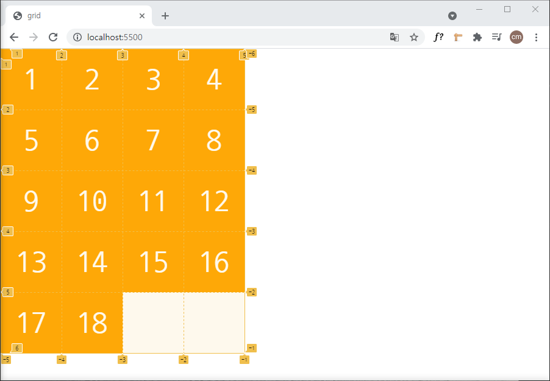

<br>

`grid-auto-flow` 도 `template` 에 포함되지 않은 `item` 들이 대상이다.

이 `item` 을 어떻게 자동 배치할 것인지를 값으로 정의한다.

값으로는 `row` `column` `dense` 가 있다.

만약에 `auto-flow` 를 `column` 으로 바꾸면 위 예시에서 17, 18번 `item` 이 아래처럼 위치한다.

그래서 `auto-columns` 값을 주어야 원하는 일정한 크기로 바꿀 수 있다.

```css
.container {
  display: grid;
  grid-template-columns: repeat(4, 100px);
  grid-template-rows: repeat(4, 100px);
  grid-auto-flow: column;
  grid-auto-column: 100px;
}
```

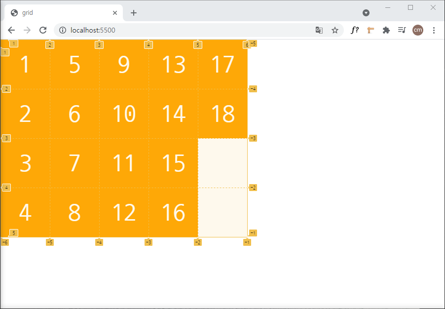

`dense` 는 배치 할 때 앞부분에 빈 공간이 생기면 뒤의 `item` 으로 채워넣는 방식을 말한다.

예시를 통해 보면 2번 `item` 이 2번째 `row` 4칸을 모두 차지해 앞 부분이 비어있다.

```css
.container {
  display: grid;
  grid-template-columns: repeat(4, 100px);
  grid-template-rows: repeat(4, 100px);
}

.item:nth-child(2) {
  grid-column: span 4;
}
```

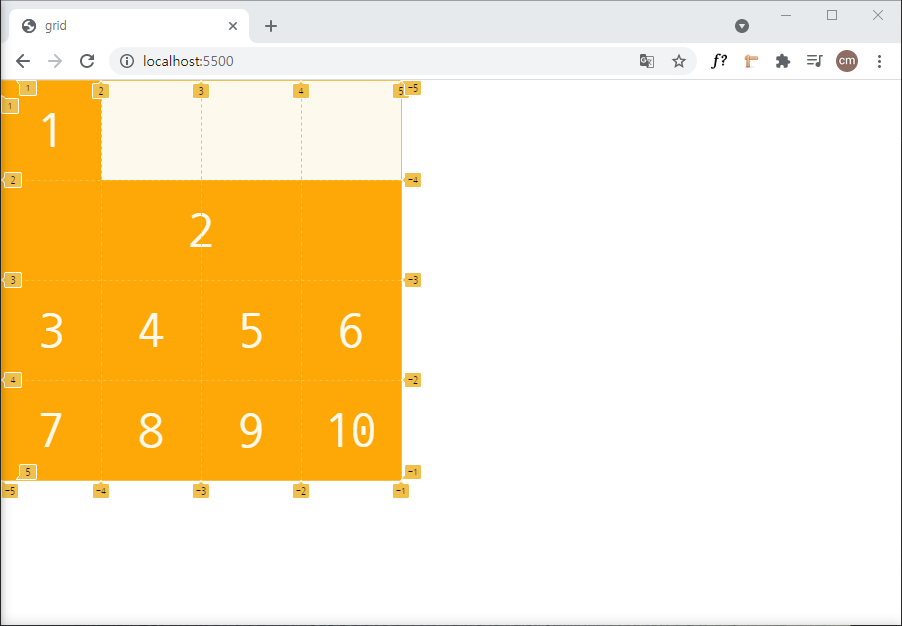

이럴 때 저 앞 부분을 채워주는 방식이 `dense` 이다.

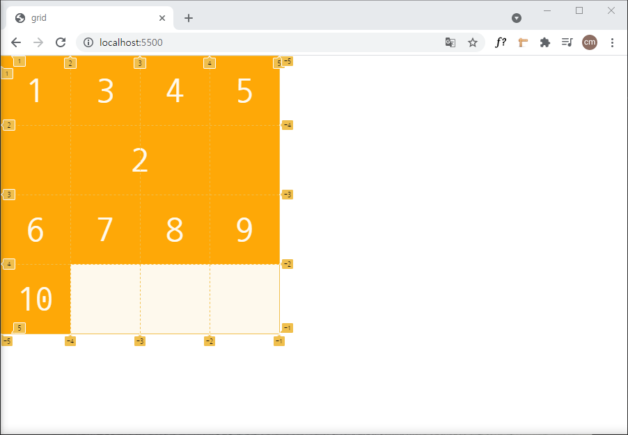

<br>

#### min-content and max-content

`min-content` 는 내용을 최소로 줄인 크기만큼을 차지한다는 의미이다.

`max-content` 는 반대로 최대로 늘린 크기를 차지한다.

```css
.container {
  display: grid;
  grid-template-columns: repeat(5, min-content);
}
```

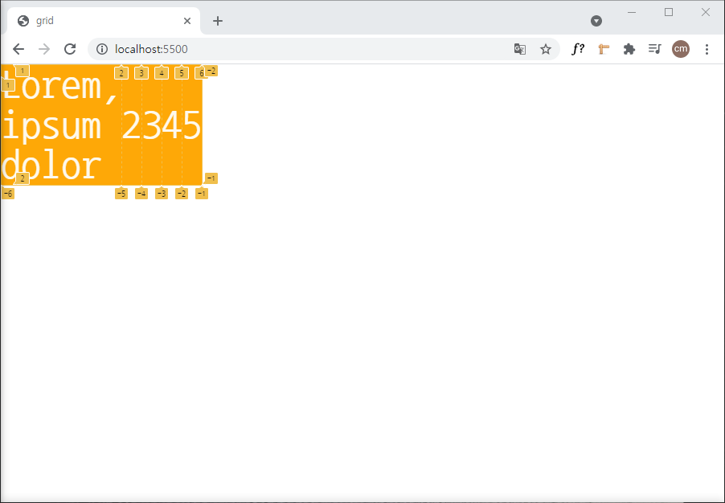

```css
.container {
  display: grid;
  grid-template-columns: repeat(5, max-content);
}
```

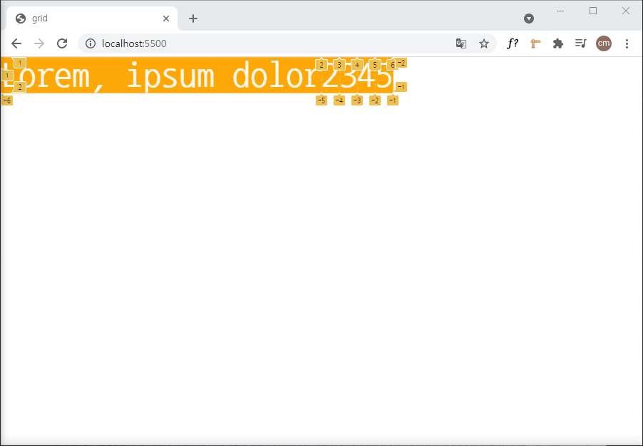

<br>

#### auto-fill and auto-fit

```css
.container {
  display: grid;
  grid-template-columns: repeat(/* what */, minmax(100px, 1fr));
}
```

`/* what */` 부분에 `auto-fill` 과 `auto-fit` 으로 둘의 차이를 알아보자.

`auto-fill` 은 채울 수 있는 만큼의 영역을 최대로 채울 수 있다.

`auto-fit` 은 `item` 을 빈 공간이 없이 채울 수 있는 최대로 채운다.

두 가지가 비슷한 것 같지만 다르다.

`auto-fill` 의 경우 아래처럼 빈 공간까지도 최대로 채운다.

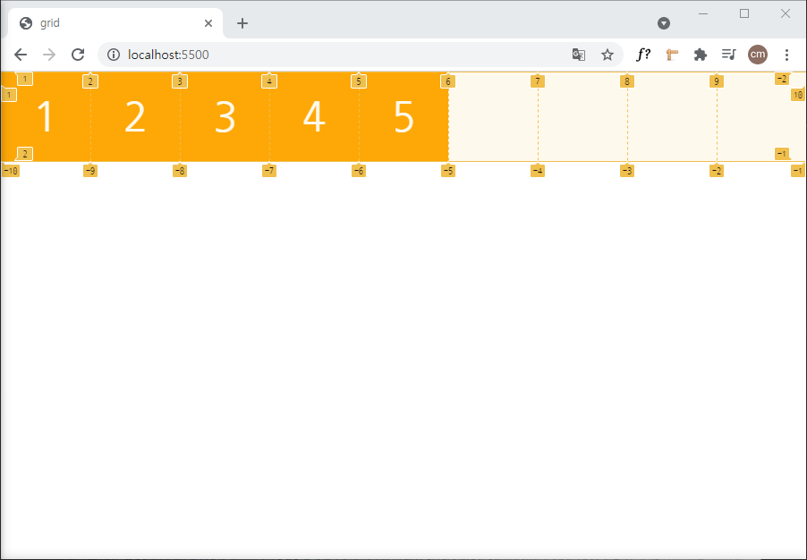

`auto-fit` 은 아래처럼 빈 공간을 찾아볼 수 없다.

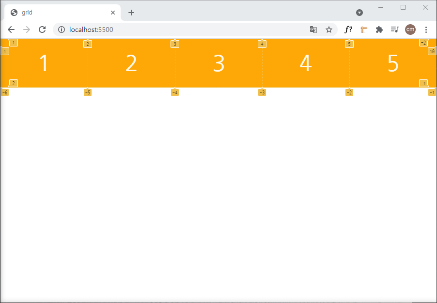
