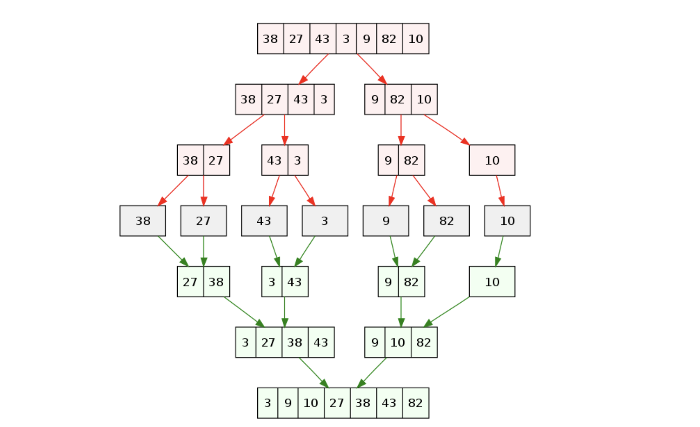

# Sort

정렬은 순서 없이 배열된 데이터를 오름차순이나 내림차순으로 재배열하는 것이다.

데이터를 정렬할 때 기준이 되는 값을 `키(key)` 라고 한다.

정렬의 종류는 다양하게 존재하는데 그 중 몇 가지 정도만 정리해보자.

여기서 예시를 통해 설명하는 정렬은 오름차순을 기준으로 하고 코드 구현은 일반적인 숫자 배열을 기준으로 한다.

<br>

## Bubble Sort


거품 정렬이라고 불리는 이 정렬은 서로 **인접한 두 데이터**를 비교하여 작은 값을 앞쪽에 배치하는 자리 **교환** 과정을 반복하여 정렬하는 방법이다.

아래 표를 배열처럼 이용하여 거품 정렬의 과정을 살펴보자.

| 8    | 2    | 5    | 4    | 1    |
| ---- | ---- | ---- | ---- | ---- |

`8` 과 `2` 를 비교하고 `2` 가 작으니 교환한다.

| 2    | 8    | 5    | 4    | 1    |
| ---- | ---- | ---- | ---- | ---- |

`8` 과 `5` 를 비교하고 `5` 가 작으니 교환한다.

| 2    | 5    | 8    | 4    | 1    |
| ---- | ---- | ---- | ---- | ---- |

`8` 과 `4` 를 비교하고 `4` 가 작으니 교환한다.

| 2    | 5    | 4    | 8    | 1    |
| ---- | ---- | ---- | ---- | ---- |

`8` 과 `1` 을 비교하고 `1` 이 작으니 교환한다.

`8` 은 정렬이 된 데이터가 된다. 정렬되었다는 표시를 위해 한글로 표시한다.

| 2    | 5    | 4    | 1    | 팔   |
| ---- | ---- | ---- | ---- | ---- |

`2` 와 `5` 을 비교하여 `2` 가 작으니 자리를 유지한다.

`5` 와 `4` 를 비교하여 `4` 가 작으니 교환한다.

| 2    | 4    | 5    | 1    | 팔   |
| ---- | ---- | ---- | ---- | ---- |

`5` 와 `1` 을 비교하여 `1` 이 작으니 교환한다.

`5` 도 정렬된 데이터가 된다.

| 2    | 4    | 1    | 오   | 팔   |
| ---- | ---- | ---- | ---- | ---- |

`2` 와 `4` 를 비교하여 `2` 작으니 자리를 유지한다.

`4` 와 `1` 을 비교하여 `1` 이 작으니 교환한다.

`4` 도 정렬된 데이터가 된다.

| 2    | 1    | 사   | 오   | 팔   |
| ---- | ---- | ---- | ---- | ---- |

마지막으로 `2` 와 `1` 을 비교하여 `1` 이 작으니 자리를 바꾸어 정렬이 완료가 되는 것이다.

| 일   | 이   | 사   | 오   | 팔   |
| ---- | ---- | ---- | ---- | ---- |

거품 정렬의 과정은 이와 같다.

이를 코드로 구현해보자.

```js
import { swap } from "./sort.common-function.js";

const bubbleSort = (array, order) => {
    for (let i = 0; i < array.length - 1; i++) {
        for (let j = 0; j < array.length - i - 1; j++) {
            // 기준
            if (order(array[j], array[j + 1])) {
                // ㄱ
                swap(array, j, j + 1);
            }
        }
    }
};

export default bubbleSort;
```

<br>

## Selection Sort


선택 정렬은 기준이 되는 위치에 맞는 데이터를 **선택**하여 자리를 **교환**하는 방식이다.

기준 위치는 배열의 처음부터 차례대로 나아간다.

데이터가 교환되는 방식은 정렬된 데이터들을 제외한 데이터들 중 가장 작은 값을 가진 데이터와 기준 위치의 데이터를 교환하는 것이다.

이것도 아래 표를 배열처럼 사용하여 같은 예시로 선택 정렬의 과정을 살펴보자.

| 8    | 2    | 5    | 4    | 1    |
| ---- | ---- | ---- | ---- | ---- |

기준 위치는 `index = 0` 이고 가장 작은 데이터는 `1` 이다.

`index = 0` 의 데이터 `8` 과 `1` 을 교환한다.

이제 `1` 은 정렬된 데이터로 한글로 표현한다.

| 일   | 2    | 5    | 4    | 8    |
| ---- | ---- | ---- | ---- | ---- |

다음 기준 위치는 `index = 1` 이고 가장 작은 데이터는 `2` 이다.

기준 데이터와 가장 작은 데이터가 같아 자리는 유지되고 `2` 는 정렬된 데이터이다.

| 일   | 이   | 5    | 4    | 8    |
| ---- | ---- | ---- | ---- | ---- |

다음 기준 위치는 `index = 2` 이고 가장 작은 데이터는 `4` 이다.

`index = 2` 의 데이터 `5` 와 `4` 를 교환한다.

| 일   | 이   | 사   | 5    | 8    |
| ---- | ---- | ---- | ---- | ---- |

다음 기준 위치는 `index = 3` 이고 기준 데이터가 가장 작은 데이터이므로 자리를 유지한다.

| 일   | 이   | 사   | 오   | 8    |
| ---- | ---- | ---- | ---- | ---- |

이제 마지막 하나만 남았기 때문에 정렬은 종료가 된다.

| 일   | 이   | 사   | 오   | 팔   |
| ---- | ---- | ---- | ---- | ---- |

이것이 선택 정렬 과정이다.

이를 코드로 구현해보자.

```js
import { swap } from "./sort.common-function.js";

const selectionSort = (array, order) => {
    let idx;
    for (let i = 0; i < array.length; i++) {
        idx = i;
        // 정렬 안 된 부분
        for (let j = i + 1; j < array.length; j++) {
			// 기준
            if (order(array[idx], array[j])) {
                // 선택한 인덱스
                idx = j;
            }
        }
        // 교환
        swap(array, i, idx);
    }
};

export default selectionSort;
```

<br>

## Insertion Sort


삽입 정렬은 정렬된 부분과 정렬이 안 된 부분으로 나누고 정렬이 안 된 부분의 가장 왼쪽 데이터를 정렬된 부분의 알맞은 위치에 **삽입**하는 과정을 반복한다.

표를 이용한 예시를 통해 삽입 정렬의 과정을 살펴보자.

| 팔   | 2    | 5    | 4    | 1    |
| ---- | ---- | ---- | ---- | ---- |

처음 `index = 0` 인 데이터를 정렬된 부분을 그룹 A라 하고, 나머지를 정렬이 안 된 부분은 그룹 B로 나누고 시작한다.

정렬 안 된 부분의 가장 왼쪽 데이터인 `2` 는 그룹 A에서 `8` 보다 작기 때문에 시프트 후 `8` 앞에 삽입한다.

| 이   | 팔   | 5    | 4    | 1    |
| ---- | ---- | ---- | ---- | ---- |

그룹 B에서 가장 왼쪽인 `5` 는 그룹 A에서 `2` 보다 크고 `8` 보다 작기 때문에 시프트 후 `8` 앞에 삽입한다.

| 이   | 오   | 팔   | 4    | 1    |
| ---- | ---- | ---- | ---- | ---- |

그룹 B에서 가장 왼쪽인 `4` 는 그룹 A에서 `2` 와 `5` 사이이기 때문에 `5` 이후의 값들을 시프트 후 `5` 앞에 삽입한다.

| 이   | 사   | 오   | 팔   | 1    |
| ---- | ---- | ---- | ---- | ---- |

마지막 `1` 은 그룹 A에서 가장 작기 때문에 다 시프트하고 맨 앞에 삽입한다.

| 일   | 이   | 사   | 오   | 팔   |
| ---- | ---- | ---- | ---- | ---- |

이러면 정렬이 완료된다.

이를 코드로 구현해보자.

```js
const insertionSort = (array, order) => {
    let tmp, j;
    // 정렬 안 된 부분
    for (let i = 1; i < array.length; i++) {
        // 가장 왼쪽 값 저장
        tmp = array[i];
        // 정렬 된 부분
        for (j = i - 1; j >= 0; j--) {
            // 시프트
            array[j + 1] = array[j];
            // 알맞은 위치를 찾으면 반복문 exit
            if (order(tmp, array[j])) {
                break;
            }
        }
        // 찾은 위치에 삽입
        array[j + 1] = tmp;
    }
};

export default insertionSort;
```

<br>

## Merge Sort


정렬되지 않은 데이터들의 집합을 부분집합으로 분할하고 각 부분집합에 대해서 정렬 작업을 하여 이를 다시 합치는 방식이 병합 정렬이다.

조금 더 숫자적(?)으로 말하면 `N` 개의 숫자를 `N/2` 개씩 `2` 개의 부분 문제로 분할한다.

분할은 부분 문제의 크기가 `1` 이 될 때까지 하고 각 부분문제를 재귀적으로 정렬하고 합병해나간다는 의미이다.

마크다운 특성 상 이번 내용은 표를 이용하여 설명하는 것이 까다로워 그림을 참조해 예시를 살펴보자.



그림에서 보면 빨간 부분들이 분할을 나타내는 것이다. 배열의 크기가 1이 될 때 까지 분할하고 이후에 초록 부분들을 보면 각각이 정렬되면서 병합되는 것을 알 수 있다.

이를 코드로 구현하면 아래와 같다.

```js
const mergeSort = (array, order) => {
    if (array.length === 1) return array;
    // 분할 기준 인덱스
    const middleIndex = Math.floor(array.length / 2);
    // 분할
    const left = mergeSort(array.slice(0, middleIndex), order);
    const right = mergeSort(array.slice(middleIndex), order);
    // 병합
    let i = 0,
        j = 0,
        k = 0;
    while (i < left.length && j < right.length) {
        array[k++] = order(left[i], right[j]) ? right[j++] : left[i++];
    }
    while (i < left.length) array[k++] = left[i++];
    while (j < right.length) array[k++] = right[j++];

    return array;
};

export default mergeSort;
```

<br>

## Quick Sort


퀵 정렬은 피봇이라 부르는 배열 중 하나의 원소를 기준으로 작으면 왼쪽으로 크면 오른쪽으로 분할하고 피봇의 위치를 고정시키며 정렬하는 방식이다.

퀵 정렬도 병합 정렬처럼 2개의 부분문제로 분할하는데 차이점이 있다.

병합은 부분문제의 크기가 문제의 1/2크기로 일정하지만 퀵은 부분문제의 크기가 일정하지 않다.


퀵 정렬의 성능은 피봇에 좌우되는데 피봇이 가장 작은 숫자나 큰 숫자일 경우 분할 시에 한쪽으로 치우쳐지는 현상이 발생할 수 있는데 이런 경우가  반복 되면 성능이 떨어진다.

일반적으로 피봇을 선정하는 방법으로는 랜덤으로 선정하거나 가장 왼쪽 숫자, 중간 숫자, 가장 오른쪽 숫자 중에서 중앙값을 피봇으로 선정한다.

2번째 방법을 사용하여 피봇을 선정해보자.

세 수에서 중앙값을 찾는 방법은 조건문을 통해서 비교해서 크기가 중간인 수를 찾을 수 있는데 XOR의 교환법칙과 결합법칙을 이용하여 구현해보려 한다.

세 수를 각 A, B, C라고 할 때 먼저 최댓값과 최솟값을 찾아준다.

그리고 이 다섯가지 값을 XOR해주면 중앙값이 나온다. 예를 들어 A가 최댓값이고 C가 최솟값이라고 할 때 중앙 값의 결과는 A ⊕ B ⊕ C ⊕ A ⊕ C 인데 이를 교환법칙과 결합법칙을 이용하여 바꿔주면 (A ⊕ C) ⊕ (A ⊕ C) ⊕ B 와 같다.

(A ⊕ C) 를 서로 XOR하면 0이고 0과 B를 XOR하면 B이다.

```js
const median = (a, b, c) => {
    const max = Math.max(Math.max(a, b), c);
    const min = Math.min(Math.min(a, b), c);
    return a ^ b ^ c ^ max ^ min;
};
```

랜덤 수 10만 개의 퀵 정렬에서 위와 같은 피봇 선정은 마지막 원소를 피봇으로 선정하는 것 보다 느렸는데 아직 정확한 이유를 모르겠다.

아래 코드는 마지막 원소를 피봇으로 선정하는 경우이다.

```js
import { swap } from "./sort.common-function.js";

const quickSort = (
    array,
    order,
    startIndex = 0,
    endIndex = array.length - 1
) => {
    const pivot = array[endIndex];
	// pivot의 위치 확정을 위한 변수
    let pivotIndex = startIndex;
    for (let i = startIndex; i < endIndex; i++) {
        if (order(pivot, array[i])) {
            // 시작 인덱스부터 pivot과의 크기 비교를 통해 위치를 한 칸씩 늘림
            swap(array, pivotIndex, i);
            pivotIndex++;
        }
    }
    // pivot을 pivotIndex위치에 옮겨줌
    swap(array, pivotIndex, endIndex);
    // pivot기준 왼쪽 정렬
    // pivotIndex - 1은 왼쪽의 마지막 인덱스인데 시작 인덱스와 같으면 종료
    if (pivotIndex - 1 > startIndex) {
        quickSort(array, order, startIndex, pivotIndex - 1);
    }
    // pivot기준 오른쪽 정렬
    // pivotIndex - 1은 오른쪽의 첫번째 인덱스인데 끝 인덱스와 같으면 종료
    if (pivotIndex + 1 < endIndex) {
        quickSort(array, order, pivotIndex + 1, endIndex);
    }
};

export default quickSort;
```

<br>

## Performance Check

랜덤 수 100,000개의 배열을 각 정렬 알고리즘으로 시간 측정을 해볼 수 있다.

```js
import bubbleSort from "./sort.bubble.js";
import selectionSort from "./sort.selection.js";
import insertionSort from "./sort.insertion.js";
import mergeSort from "./sort.merge.js";
import quickSort from "./sort.quick.js";
import { ascending, descending } from "./sort.common-function.js";

const NUMBER_OF_DATA = 100000;

const INITIAL_ARRAY = Array.from(
    { length: NUMBER_OF_DATA },
    () => Math.floor(Math.random() * NUMBER_OF_DATA) + 1
);

const getTime = (array, sort, order) => {
    const start = Date.now();
    sort(array, order);
    return Date.now() - start;
};

const sortAlgorithm = [
    bubbleSort,
    selectionSort,
    insertionSort,
    mergeSort,
    quickSort,
];

sortAlgorithm.forEach((sort) => {
    const array = [...INITIAL_ARRAY];
    const time = getTime(array, sort, ascending);
    console.log(`${sort.name} : ${time}ms`);
});
```

결과 값은 아래와 같다.

```
bubbleSort : 31107ms
selectionSort : 8047ms
insertionSort : 3378ms
mergeSort : 44ms
quickSort : 37ms
```

