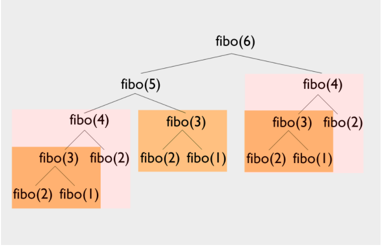

# Dynamic Programming

작은 부분 문제로 큰 문제를 해결해 결과를 얻는 알고리즘을 말한다.

`memoization` 은 중복되는 동일한 부분 문제에 대한 결과를 저장해두었다가 다시 활용하여 중복되는 계산을 줄이는 것을 의미하는데 이를 활용하여 동일한 계산의 반복을 이미 계산된 값으로 빠른 연산을 할 수 있다.



위 그림은 피보나치 수열에 대한 그림을 나타낸 것이다.

같은 색깔로 구분되어 있는 것들이 중복되는 부분 문제들이라고 할 수 있다.

저 부분 문제들을 한 번 연산하여 결과 값을 저장해 두고 또 마주치면 사용하는 형식이다.


## implement way

구현방식은 두 가지로 볼 수 있다.

### top-down

재귀를 통해 큰 문제를 작은 문제로 나누어 해결하는 방법을 말한다.

```js
const topDown = (n, d = []) => {
    if (n < 2) return n;
    if (d[n]) return d[n];
    
    d[n] = topDown(n - 1) + topDown(n - 2);
    
    return d[n];
}
```

`if` 문으로 `d[n]` 의 존재 여부를 확인하는 것이 작은 부분 문제의 결과 값이 있는지 확인하는 조건문이다.

### bottom-up

작은 문제부터 큰 문제로 차례대로 답을 찾아나가는 방식을 말한다.

```js
const bottomUp = (n, d = []) => {
    d[0] = 0;
    d[1] = 1;
    
    for (let i = 2; i <= n; i++) {
        d[i] = d[i - 1] + d[i - 2];
    }
    
    return d[n];
}
```

작은 문제인 `0` 과 `1` 번째 값을 저장해두고 반복문을 돌면서 점점 큰 문제의 결과값을 찾아가는 형식이다.

예로 피보나치 수열을 통해 보았는데 다른 문제들은 어떤 식으로 진행할 수 있는지 알아보자.


## Problem 1

2진수를 학습하던 윤주는 색종이로 이를 표현하려고 한다.

2진수의 1은 붉은색 종이로, 0은 흰색 종이로 표현할 때, 흰색 종이가 무수히 많은 윤주는 붉은색 종이를 얼마나 준비해야 하는지 궁금해졌다.

숫자 n이 주어질 때, 0부터 n까지의 수를 색종이로 표현하려고 한다.

이때, 윤주가 준비해야 하는 붉은색 종이의 수를 구하는 함수 solution을 완성하자.

### solution

이 문제는 n이 주어지면 0부터 n까지의 이진수 중에 1의 개수를 구하는 문제이다.

이진수를 자세히 보면 자릿수가 하나씩 늘어날 때 마다 그 전의 작은 숫자들의 이진수들이 포함되어 있는 것을 알 수 있다.

그래서 자릿수가 바뀌는 2의 거듭제곱 수를 나눈 나머지 수의 결과 값에 자릿 수가 늘어나 생긴 1의 개수 하나를 더해주면 되는 것이다.

5를 예로 들면 4로 나눈 나머지의 값은 1이다.

1일때 1의 개수는 1이고 자릿수는 늘어나 있기 때문에 +1을 해주어 결과 값 2를 얻을 수 있는 형태이다.

| 십진수 | 이진수 | 1의 개수 |
| ------ | ------ | -------- |
| 0      | 0      | 0        |
| 1      | 1      | 1        |

| 십진수 | 이진수 | 1의 개수                    |
| ------ | ------ | --------------------------- |
| 2      | 10     | (2%2)번째 결과 값 0 + 1 = 1 |
| 3      | 11     | (3%2)번째 결과 값 1 + 1 = 2 |

| 십진수 | 이진수 | 1의 개수                    |
| ------ | ------ | --------------------------- |
| 4      | 100    | (4%4)번째 결과 값 0 + 1 = 1 |
| 5      | 101    | (5%4)번째 결과 값 1 + 1 = 2 |
| 6      | 110    | (6%4)번째 결과 값 1 + 1 = 2 |
| 7      | 111    | (7%4)번째 결과 값 2 + 1 = 3 |

이제 코드를 작성해보자.

```js
const solution = (n) => {
    // 0과 1의 결과값 저장
    const arr = [0, 1];
    // 나머지 연산에 필요한 자릿수가 바뀌는 2의 거듭제곱 수를 저장할 변수 
    let tmp = 0;
    for (let i = 2; i <= n; i++) {
        // 2의 거듭제곱인 경우를 나타내는 식
        if (!(i & (i - 1))) {
            tmp = i;
        }
        // 결과 값 누적
        arr[i] = arr[i % tmp] + 1;
    }
    // 최종적으로 합산하여 리턴
    return arr.reduce((sum, el) => sum + el, 0);
};
```

중요한 부분은 반복문 내에서 2의 거듭제곱 수 찾는 `if문` 부분과 결과 값을 누적하는 부분을 보면 된다.


## Problem 2

Finn은 편의점에서 야간 아르바이트를 하고 있다. 야간에 손님이 너무 없어 심심한 Finn은 손님들께 거스름돈 n원을 줄 때 방법의 경우의 수를 구하기로 했다.

예를 들어 손님께 5원을 거슬러 줘야하고 1원, 2원, 5원이 있다면 다음과 같은 4가지의 방법으로 거슬러 줄 수 있다.

- 1원을 5개 사용한다.
- 1원 3개, 2원 1개를 사용한다.
- 1원 1개, 2원 2개를 사용한다.
- 5원을 1개 사용한다.

거슬러 줘야 하는 금액 n과 Finn이 현재 보유하고 있는 돈의 종류 money가 매개변수로 주어질 때, Finn이 n원을 거슬러 줄 방법의 수를 return 하도록 solution 함수를 완성하자.

**제한사항**

- n은 100,000 이하의 자연수이다.
- 화폐 단위는 100종류 이하이다.
- 모든 화폐는 무한하게 있다고 가정한다.
- 정답이 커질 수 있으니 1,000,000,007로 나눈 나머지를 return 하자.

### solution

거스름 돈을 0원 부터 n원까지의 경우의 수로 나눈다.

화폐 단위 만큼을 제외한 거스름의 경우의 수를 누적시키는 형태이다.

아래 표를 이용해 자세히 한번 살펴보자.

거스름 n을 5라고 가정할 때 화폐 단위가 0원 일때의 경우의 수는 [1, 0, 0, 0, 0, 0] 배열을 가진다.

화폐 단위가 1일 경우에는 이렇게 변화한다.

| 거스름 | 경우의 수                                                    |
| ------ | ------------------------------------------------------------ |
| 1      | 0 + 거스름 [1-1(화폐단위)] 을 만들 수 있는 경우의 수 1 = 1 [1] |
| 2      | 0 + 거스름 [2-1(화폐단위)] 을 만들 수 있는 경우의 수 1 = 1 [1, 1] |
| 3      | 0 + 거스름 [3-1(화폐단위)] 을 만들 수 있는 경우의 수 1 = 1 [1, 1, 1] |
| 4      | 0 + 거스름 [4-1(화폐단위)] 을 만들 수 있는 경우의 수 1 = 1 [1, 1, 1, 1] |
| 5      | 0 + 거스름 [5-1(화폐단위)] 을 만들 수 있는 경우의 수 1 = 1 [1, 1, 1, 1, 1] |

화폐 단위가 1인 경우로 확인하니 잘 감이 안올 수 있다.

1인 경우를 제외하고 다시 2인 경우로 살펴 보자.

| 거스름 | 경우의 수                                                    |
| ------ | ------------------------------------------------------------ |
| 2      | 0 + 거스름 [2-2(화폐단위)] 을 만들 수 있는 경우의 수 1 = 1 [2] |
| 3      | 0 + 거스름 [3-2(화폐단위)] 을 만들 수 있는 경우의 수 0 = 0   |
| 4      | 0 + 거스름 [4-2(화폐단위)] 을 만들 수 있는 경우의 수 1 = 1 [2, 2] |
| 5      | 0 + 거스름 [5-2(화폐단위)] 을 만들 수 있는 경우의 수 0 = 0   |

이제 하나 씩 살펴봤으니 화폐 단위의 종류가 1과 2 두가지인 경우도 한 번 살펴보면 완벽하게 이해가 될 것이다.

단위가 1인 경우에서 누적시키는 것이다.

| 거스름 | 경우의 수                                                    |
| ------ | ------------------------------------------------------------ |
| 2      | 화폐단위 1일때 누적된 경우의 수 1 + 거스름 [2-2(화폐단위)] 을 만들 수 있는 경우의 수 1 = 2 [1, 1] [2] |
| 3      | 화폐단위 1일때 누적된 경우의 수 1 + 거스름 [3-2(화폐단위)] 을 만들 수 있는 경우의 수 1 = 2 [1, 1, 1] [1, 2] |
| 4      | 화폐단위 1일때 누적된 경우의 수 1 + 거스름 [4-2(화폐단위)] 을 만들 수 있는 경우의 수 2 = 3 [1, 1, 1] [1, 1, 2] [2, 2] |
| 5      | 화폐단위 1일때 누적된 경우의 수 1 + 거스름 [5-2(화폐단위)] 을 만들 수 있는 경우의 수 2 = 2 [1, 1, 1, 2] [1, 2, 2] |

배열 형태를 자세히 보면 중복되는 배열을 볼 수 있다.

이를 생각하면 경우의 수가 어떻게 누적되는지를 알 수 있다.

코드로 구현하면 아래와 같다.

```js
const solution = (n, money) => {
    // 0원의 화폐 단위의 거스름 돈 배열
    const dp = [1, ...new Array(n).fill(0)]
    // 화폐 단위마다 경우의 수를 누적 
    for (let coin of money) {
        // 화폐 단위 부터 거스름 돈까지 반복
        for (let price = coin; price <= n; price++) {
            // 화폐 단위 만큼을 제외한 거스름 돈의 경우의 수를 누적
            dp[price] += dp[price - coin]
        }
    }
    // 마지막 거스름 돈의 경우의 수가 정답
    return dp[n]
}
```

