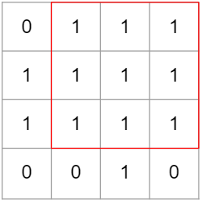
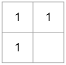

# Find Biggest Square

1과 0으로 채워진 표가 있다. 표 1칸은 1x1 크기의 정사각형으로 이루어져 있다. 표에서 1로 이루어진 가장 큰 정사각형을 찾아 넓이를 리턴하는 solution 함수를 완성하자.



위 그림과 같은 경우는 빨간 테두리의 사각형이 가장 큰 정사각형이다.

<br>

## How to Solve

이것도 `dp` 문제의 일종인 것 같다고 생각했다.

각 칸 별로 최대 정사각형의 크기를 저장해두고 그것을 이용해서 최종적인 해를 뽑아내는 방식으로 생각했다.

이 방식은 3칸으로 현재칸의 최대 정사각형 크기를 알 수 있다.



빈 칸 위치의 표를 보았을 때 만약에 1이라면 빈 칸 기준에서 위 그림과 같은 위치의 3개의 최솟값에 1을 더한 값을 저장하면 된다.

그림에서 만약 빈 칸 제외 3칸의 값이 모두 2라면 3이 되는 것이다.

설명하는 글을 쓰는 것이 생각보다 어려운 문제인데 누군가에게 한 번 설명해보는 것도 좋을 것 같다.

```js
const solution = (board) => {
    const dp = Array.from({ length: board.length + 1 }, (_, i) =>
        i !== 0 ? [0, ...board[i - 1]] : new Array(board[i].length + 1).fill(0)
    );

    let result = 0;
    for (let i = 1; i < dp.length; i++) {
        for (let j = 1; j < dp[i].length; j++) {
            if (dp[i][j] !== 0) {
                dp[i][j] =
                    Math.min(
                        Math.min(dp[i - 1][j], dp[i][j - 1]),
                        dp[i - 1][j - 1]
                    ) + 1;
                result = Math.max(result, dp[i][j]);
            }
        }
    }
    return result ** 2;
};
```

