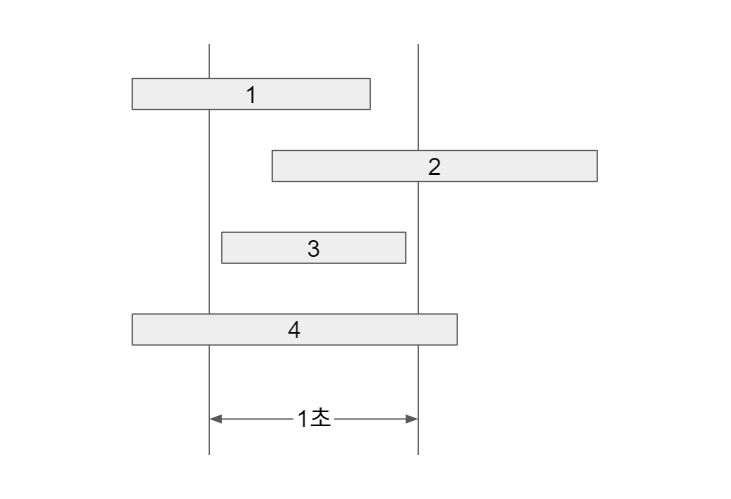

# Chuseok Traffic

[문제 링크](https://programmers.co.kr/learn/courses/30/lessons/17676)

이번 추석에도 시스템 장애가 없는 명절을 보내고 싶은 어피치는 서버를 증설해야 할지 고민이다.

장애 대비용 서버 증설 여부를 결정하기 위해 작년 추석 기간인 9월 15일 로그 데이터를 분석한 후 초당 최대 처리량을 계산해보기로 했다.

초당 최대 처리량은 요청의 응답 완료 여부에 관계없이 임의 시간부터 1초(=1,000밀리초)간 처리하는 요청의 최대 개수를 의미한다.

<br>

## Input

함수에 전달되는 `lines` 배열은 각 로그 문자열 마다 요청에 대한 응답 완료 시간 `S` 와 처리시간 `T` 가 공백으로 구분되어 있다.

`S` 는 `2016-09-15 hh:mm:ss.sss` 형식으로 되어있다.

`T` 는 초 단위이고 최대 소수점 셋째 자리까지 기록하고 초 단위를 의미하는 `s` 로 끝난다.

<br>

## Solution

단순하게 생각했을 때 로그의 시작부터 1밀리초마다 초당 처리량을 찾을 수 있지만 이 방법은 너무나 오래걸리기 때문에 다른 방법을 채택해야 한다.

초당 처리량이라고 하면 1초 범위 내에 로그가 진행 중이거나 완료가 되었거나 이러한 경우를 말하는데 이를 생각해보면 아래처럼 4가지의 경우가 나타난다.

1. 로그의 종료만 보이는 경우
2. 로그의 시작만 보이는 경우
3. 로그의 시작과 종료 둘 다 보이는 경우
4. 로그의 범위에 1초가 포함되는 경우



3번 같은 경우는 1번이나 2번에 포함되기 때문에 3가지 경우를 조건으로 찾을 수 있는 것이고 이는 로그의 시작시간과 종료시간을 통해서 알 수 있는 정보이다.

각 로그의 시작시간과 종료시간에서의 1초 범위내에 로그의 개수를 카운트하고 가장 많은 경우를 리턴해주면 된다.

```js
const solution = (lines) => {
    const log = [], range = []
    for (let i = 0; i < lines.length; i++) {
        const [date, time, duration] = lines[i].split(" ")
        
        const processTime = duration.split("s")[0] * 1000
        const endTime = new Date(`${date} ${time}`).getTime()
        const startTime = endTime - processTime + 1
        
        log.push([startTime, endTime])
        range.push(startTime, endTime)
    }
    
    // 모든 시간(로그의 시작과 끝 시간 전부) 오름차순 정렬
    range.sort((a, b) => a - b)
    
    // 최대 처리량 리셋
    let max = 0;
    for (let i = 0; i < range.length; i++) {
        // 범위(1초)의 시작과 끝 시간
        const sOfRange = range[i]
        const eOfRange = range[i] + 1000
        // 처리량 카운트
        let count = 0;
        for (let j = 0; j < log.length; j++) {            
            const sOfLog = log[j][0]
            const eOfLog = log[j][1]
            // 1. 로그의 시작 시간이 범위 내에 있는 경우
            if (sOfLog >= sOfRange && sOfLog < eOfRange) {
                count++
            }
            // 2. 로그의 끝 시간이 범위 내에 있는 경우
            else if (eOfLog >= sOfRange && eOfLog < eOfRange) {
                count++
            }
            // 3. 로그 내에 범위가 포함되는 경우
            else if (sOfLog <= sOfRange && eOfLog >= eOfRange) {
                count++
            }
        }
        // 최대 처리량 리셋
        if (count > max) {
            max = count
        }
    }
    
    return max
}
```


